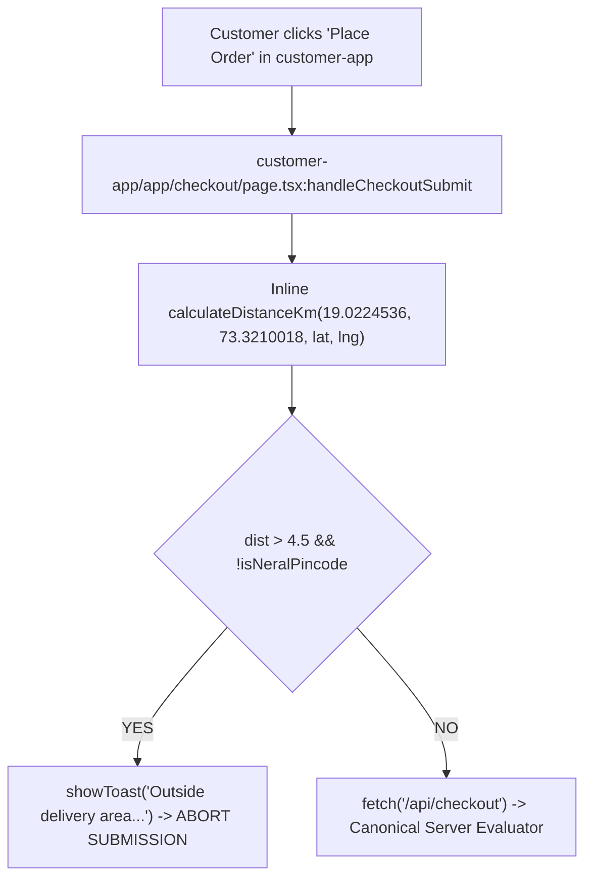
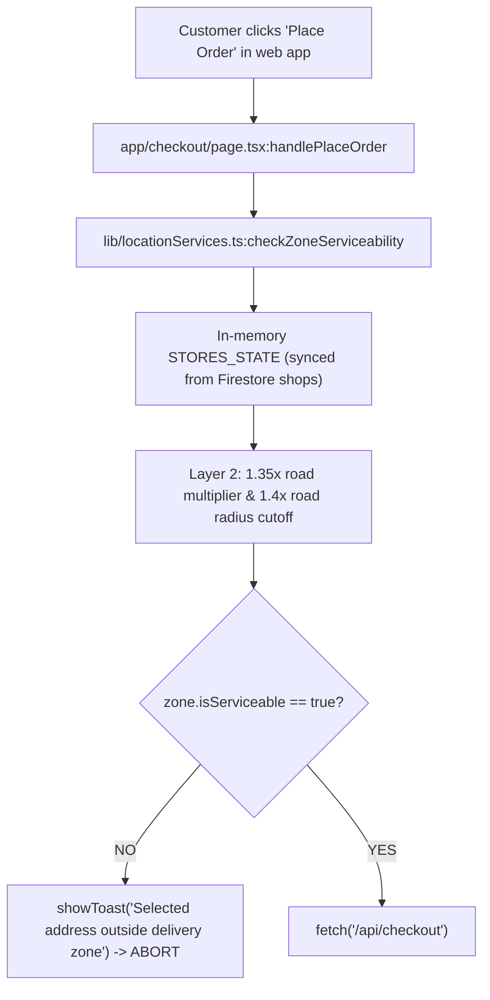
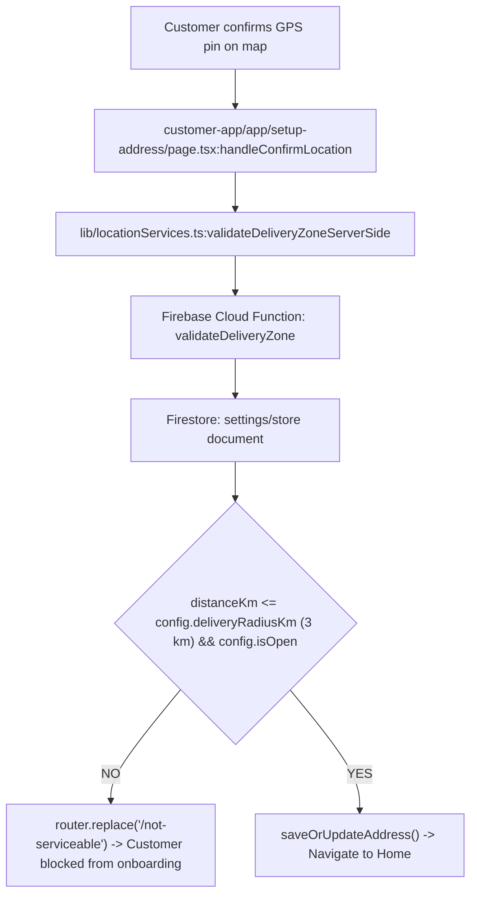
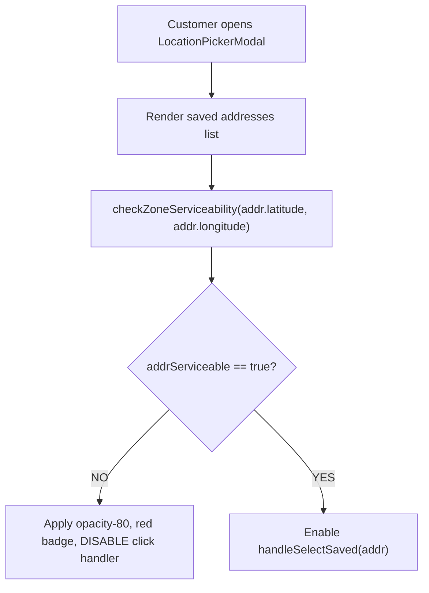
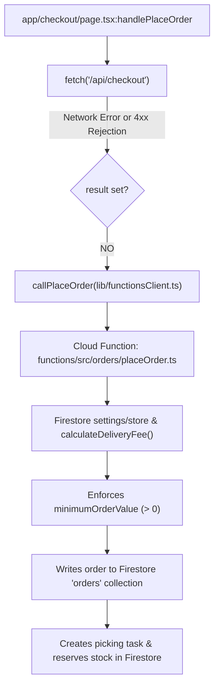
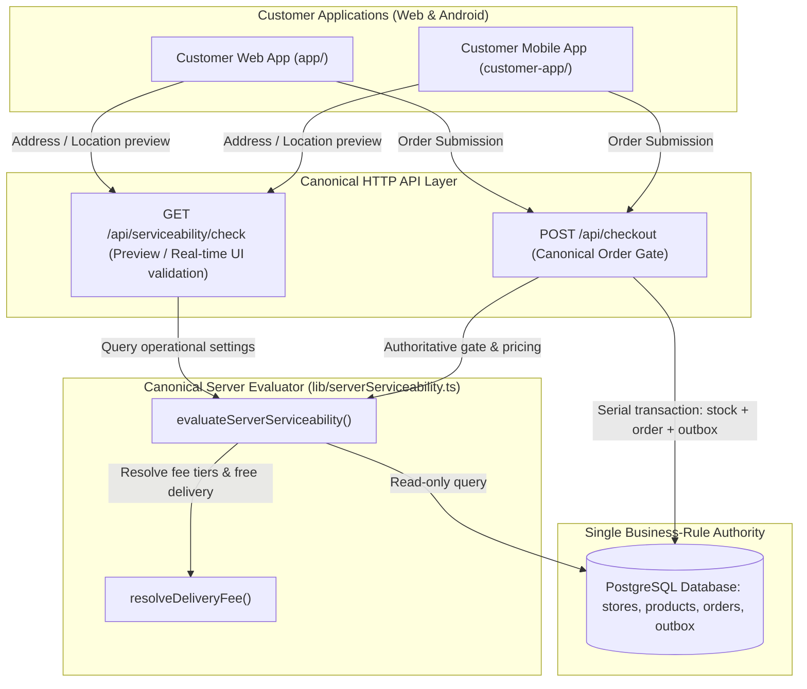

# Phase 2.7C.6 — Remediation Design & Dependency-Safe Cutover

**Document ID:** `PHASE_2_7C_6_REMEDIATION_DESIGN.md`  
**Execution Mode:** STRICTLY DESIGN / FORENSIC ANALYSIS ONLY — NO CODE CHANGES, NO DB MUTATIONS, NO COMMITS  
**Author:** Senior Production Software Architect, Backend Architect, Security Reviewer  
**Date:** 2026-10-02  
**Repository:** `PocketKirana`  
**Baseline Report:** `PHASE_2_7C_5_BUSINESS_RULE_AUTHORITY_SCAN.md` (`63dba5363579334b67e4ac9a401d94060be244bf`)  

---

## 1. Executive Summary

Phase 2.7C.5 concluded with a **RED** verdict because active production user journeys in both `customer-app` (Android/Web) and the desktop/mobile web portal (`app/`) execute competing business-rule logic before or outside the canonical PostgreSQL evaluator (`lib/serverServiceability.ts` and `POST /api/checkout`).

This document presents a comprehensive, dependency-safe, zero-downtime remediation design. The core design principle is:
> **PostgreSQL `stores` + `lib/serverServiceability.ts` is the SOLE business-rule authority for serviceability, delivery fees, free-delivery thresholds, store hours, and order creation. The client frontend must NEVER independently calculate eligibility or reject orders via hardcoded geometry or shadow Cloud Functions.**

Every active finding from F-01 through F-05 has been forensically traced to its callers, dependencies, error handling, and UX impacts. A staged, reversible cutover sequence is defined, ensuring that customer ordering, payment flows (PhonePe/COD), inventory management, and background services remain 100% stable throughout implementation.

**Final Gate Assessment:** **GREEN** — The remediation design is fully resolved, dependency-safe, and ready for Phase 2.7C.7 implementation.

---

## 2. Current RED Findings

The Phase 2.7C.5 audit identified five active competing authorities:

1. **Finding F-01:** `customer-app/app/checkout/page.tsx:152-166`
   - Inline Haversine pre-check using hardcoded Maule Kirana coordinates `(19.0224536, 73.3210018)`, hardcoded 4.5 km radius cutoff, and arbitrary pincode/text string matching (`410101`, `"neral"`). Rejects orders client-side before calling `POST /api/checkout`.
2. **Finding F-02:** `app/checkout/page.tsx:204-207` (and `lib/locationServices.ts:693-760`)
   - Client-side checkout blocker invoking `checkZoneServiceability`. Evaluates serviceability using in-memory `STORES_STATE` (populated from Firestore `fetchShopsFS()`), applying a 1.35× road-detour multiplier and a 1.4× road distance cutoff, terminating checkout submission client-side.
3. **Finding F-03:** `customer-app/app/setup-address/page.tsx:112, 130-135`
   - Address confirmation flow invoking `validateDeliveryZoneServerSide()`, which calls Firebase Cloud Function `validateDeliveryZone` (backed by Firestore `settings/store`), with fallback to hardcoded 4.5 km coordinates. Rejects valid customer addresses and forcibly redirects users to `/not-serviceable`.
4. **Finding F-04:** `components/customer/LocationPickerModal.tsx:521-527`
   - Saved address selector calling `checkZoneServiceability(addr.latitude, addr.longitude)` and disabling user click-selection (`onClick={() => addrServiceable && handleSelectSaved(addr)}`), preventing customers from selecting addresses that fail legacy in-memory rules.
5. **Finding F-05 (Highest Priority):** `app/checkout/page.tsx:268-280`
   - Unhandled/fallback order submission branch calling `callPlaceOrder` (Cloud Function `placeOrder`). If `POST /api/checkout` fails or returns an error, the client attempts to create an order in Firestore, bypassing PostgreSQL, enforcing legacy `minimumOrderValue`, and applying non-canonical delivery charges.

---

## 3. Dependency Graphs

### Finding F-01 Dependency Graph

*Root cause:* Client-side filter acts as an unauthorized gatekeeper before the canonical API.

### Finding F-02 Dependency Graph

*Root cause:* Legacy multi-layer serviceability engine evaluates in-memory/Firestore state and aborts valid checkouts.

### Finding F-03 Dependency Graph

*Root cause:* Cloud Function and Firestore dictate address onboarding eligibility instead of PostgreSQL.

### Finding F-04 Dependency Graph

*Root cause:* Address selection is disabled client-side by legacy in-memory checks.

### Finding F-05 Dependency Graph (Shadow Order Path)

*Root cause:* Silent fallback to Cloud Functions creates dual order authorities and violates PostgreSQL order primacy.

---

## 4. Target Remediation Architecture

The target architecture unifies all client and mobile applications under a single authoritative backend path:



### Architectural Guarantees
1. **Zero Client Authority:** Clients NEVER decide whether an address is serviceable, what the fee is, or whether free delivery applies.
2. **Pure Haversine:** Geographic eligibility is calculated exclusively as straight-line Haversine distance from PostgreSQL store coordinates.
3. **Zero Road Multipliers:** Detour multipliers (1.35×) and road limits are completely removed from all active validation paths.
4. **Zero Minimum Order Requirement:** Neither checkout gate nor serviceability check will ever reject an order due to cart subtotal.
5. **Single Order-Creation Gate:** `POST /api/checkout` is the only customer order writer. Cloud Function fallback is completely removed.

---

## 5. Per-Finding Cutover Plan

---

### Finding F-01 Cutover Plan
* **Target File:** `customer-app/app/checkout/page.tsx` (Lines 152–166)
* **Current Behavior:** Rejects orders if Haversine distance to `(19.0224536, 73.3210018)` exceeds 4.5 km and address text does not match "neral".
* **Proposed Replacement:**
  - Remove lines 152–166 completely.
  - Rely directly on `POST /api/checkout`.
  - When `POST /api/checkout` is called, the server runs `evaluateServerServiceability`. If unserviceable, the server returns `{ success: false, error: "..." }` with status 400.
  - `customer-app/app/checkout/page.tsx` lines 222–228 ALREADY contain the exact handler for this:
    ```typescript
    else if (apiData?.error) {
      showToast(apiData.error, 'error');
      setBtnState('idle');
      isSubmittingRef.current = false;
      setFrozenSnapshot(null);
      return;
    }
    ```
* **UX Impact:** Seamless. Valid customers between 3.0 km and 5.0 km (or whichever radius is configured in PostgreSQL) are now served correctly. Out-of-zone customers receive the authoritative PostgreSQL error message instead of a hardcoded string.
* **Risk:** Extremely Low.
* **Rollback Strategy:** Re-insert the inline check chunk if an unexpected network failure rate occurs during preflight.

---

### Finding F-02 Cutover Plan
* **Target Files:** `app/checkout/page.tsx` (Lines 14, 86–99, 104–108, 174, 204–207, 516–522, 545) and `lib/locationServices.ts`
* **Current Behavior:**
  - Syncs Firestore shops into in-memory `STORES_STATE`.
  - Runs `checkZoneServiceability` to calculate road distance (1.35×) and disables button/aborts submit.
* **Proposed Replacement:**
  1. In `app/checkout/page.tsx`:
     - Replace the synchronous `checkZoneServiceability` call in `useEffect` with an asynchronous fetch to canonical `GET /api/serviceability/check?lat=${selectedAddr.latitude}&lng=${selectedAddr.longitude}&storeId=store-001&subtotal=${subtotal}`.
     - Store the canonical response in state: `{ isServiceable, distanceKm, deliveryFee, freeDeliveryThreshold, isStoreOpen, error }`.
     - Remove `fetchShopsFS()` from `loadStore()`.
     - In `handlePlaceOrder`, remove lines 204–207 (`checkZoneServiceability` blocker). Allow the order to proceed to `POST /api/checkout`. If unserviceable, `POST /api/checkout` returns 400 with the exact authoritative rejection reason.
  2. In `lib/locationServices.ts`:
     - Retain `calculateDistanceKm` as a pure mathematical Haversine utility.
     - Retain geocoding and reverse-geocoding utilities (`resolveLocationFromCoords`, `searchLocationsAutocomplete`).
     - Mark `checkZoneServiceability`, `STORES_STATE`, and `INITIAL_STORES` as `@deprecated`.
* **UX Impact:** Customer sees real-time, PostgreSQL-backed serviceability status and fee in the checkout banner. No false road-detour rejections.
* **Risk:** Low.
* **Rollback Strategy:** Revert `app/checkout/page.tsx` to read the previous state hook.

---

### Finding F-03 Cutover Plan
* **Target File:** `customer-app/app/setup-address/page.tsx` (Lines 111–135)
* **Current Behavior:** Calls `validateDeliveryZoneServerSide()`, querying Firebase Cloud Function `validateDeliveryZone` (Firestore-backed) with a fallback to hardcoded Maule Kirana coordinates. Redirects to `/not-serviceable` if false.
* **Proposed Replacement:**
  - In `customer-app/app/setup-address/page.tsx`, replace `validateDeliveryZoneServerSide(latitude, longitude)` with a call to the canonical endpoint:
    `fetch(/api/serviceability/check?lat=${latitude}&lng=${longitude}&storeId=store-001)`
  - When the response is received:
    - If `isServiceable: true`, save address and route to home (`/`).
    - If `isServiceable: false`, save the address to user addresses (preserving customer intent), but redirect to `/not-serviceable?dist=${distanceKm}&lat=${latitude}&lon=${longitude}` with authoritative metrics returned from PostgreSQL.
* **Cloud Function Deprecation:**
  - `functions/src/inventory/validateDeliveryZone.ts` is no longer called by any client. Add JSDoc `@deprecated — Replaced by canonical GET /api/serviceability/check`. Do NOT delete during C.7.
* **UX Impact:** Users onboarding addresses are evaluated against the true PostgreSQL delivery radius (3/4/5 km) instead of Firestore.
* **Risk:** Low.
* **Rollback Strategy:** Revert API fetch in `setup-address/page.tsx` back to `validateDeliveryZoneServerSide`.

---

### Finding F-04 Cutover Plan
* **Target File:** `components/customer/LocationPickerModal.tsx` (Lines 173–176, 520–535)
* **Current Behavior:** Runs `checkZoneServiceability` on all saved addresses and blocks the click handler if `!addrZone.isServiceable`.
* **Proposed Replacement:**
  - In `LocationPickerModal.tsx`, allow the customer to click and select ANY of their saved addresses:
    `onClick={() => handleSelectSaved(addr)}`
  - Remove the click blocker (`addrServiceable &&`).
  - For visual feedback: If a preview serviceability check indicates outside radius, display an informative badge ("Outside current delivery zone"), but do NOT prevent the user from selecting their address. The checkout page or serviceability banner will clearly inform them, and `POST /api/checkout` will authoritatively enforce eligibility at submission time.
  - In lines 173–176, fetch real-time serviceability for the dragged map pin from `/api/serviceability/check` instead of `checkZoneServiceability`.
* **UX Impact:** Eliminates UI freezing where a user cannot select an address to view or edit it. Allows smooth address management with clear server feedback.
* **Risk:** Extremely Low.
* **Rollback Strategy:** Restore conditional click guard in `LocationPickerModal.tsx`.

---

### Finding F-05 Cutover Plan (Highest Priority)
* **Target File:** `app/checkout/page.tsx` (Lines 264–281)
* **Current Behavior:**
  ```typescript
  // Fallback to Cloud Function if API was not reachable
  if (!result) {
    result = await callPlaceOrder({ ... });
  }
  ```
  If `POST /api/checkout` fails (including when it rejects an unserviceable order or out-of-stock item), it silently invokes `callPlaceOrder` in Firebase, creating an order in Firestore with conflicting rules!
* **Proposed Replacement:**
  - **DELETE the Cloud Function fallback completely.**
  - If `POST /api/checkout` returns `{ success: false, error: ... }`, display `showToast(data.error, 'error')` and stop.
  - If a network error occurs (fetch throws), display:
    `showToast("Network error. Please check your internet connection and try again.", "error")`
  - Retain the `idempotencyKey` so that when the user clicks "Retry", the subsequent request sends the exact same key to `POST /api/checkout`, guaranteeing no duplicate orders are created in PostgreSQL.
* **UX Impact:** Guarantees that EVERY order is processed through the canonical PostgreSQL engine. Prevents phantom Firestore orders and eliminates dual-order creation bugs.
* **Risk:** Medium (requires robust frontend error display and idempotent retry).
* **Rollback Strategy:** If PostgreSQL becomes temporarily unreachable during deployment, re-enable the fallback toggle behind an explicit environment variable (`ENABLE_LEGACY_FUNCTIONS_FALLBACK=true`).

---

## 6. Checkout Safety Matrix

| Scenario | Client Behavior | Backend Action | Resulting User State |
| :--- | :--- | :--- | :--- |
| **Serviceability API Fails (Preview)** | Banner shows: "Unable to verify delivery area. We'll verify at checkout." Submit button remains active. | None. Evaluated at checkout. | User can proceed to click checkout; final validation happens at `POST /api/checkout`. |
| **Checkout Rejects: Outside Radius** | `showToast(data.error, 'error')` | HTTP 400 returned by `POST /api/checkout`. Transaction aborted. | Cart preserved. Clear toast: "Outside delivery area (X.X km from store)". |
| **Checkout Rejects: Store Closed** | `showToast(data.error, 'error')` | HTTP 400 returned. Transaction aborted. | Cart preserved. Toast: "Store is currently closed (Hours: HH:MM - HH:MM)". |
| **Checkout Rejects: Out of Stock** | `showToast(data.error, 'error')` | HTTP 400 returned. Zero stock deducted. | Cart preserved. Toast names the exact item that has insufficient inventory. |
| **Network Disconnect during Submit** | Button re-enabled with "Retry". User clicks retry. | PostgreSQL idempotency table checks `x-idempotency-key`. If prior attempt committed, returns existing order payload. If not, executes safely. | No duplicate order created. User either gets their confirmed order or retries cleanly. |
| **Duplicate Submit (Double Click)** | Frontend disables button immediately on first click (`isSubmittingRef.current = true`). | Backend enforces single-flight transaction via `SELECT ... FOR UPDATE` and unique order idempotency. | Exactly one order created. Second request returns identical order response. |
| **Payment Initiation Fails (PhonePe)** | `showToast("Payment gateway error. Please try COD or retry.", "error")` | Order status marked as PAYMENT_PENDING or cancelled. Stock reservation handled by existing PhonePe timeout outbox worker. | User prompted to retry payment or switch to COD. |

---

## 7. Address User Experience Specification

### 1. New Address Onboarding (`setup-address`)
- Customer selects or drags GPS pin on map.
- Frontend fetches `GET /api/serviceability/check?lat=...&lng=...&storeId=store-001`.
- If serviceable: Green badge displayed ("10-minute delivery available"). Address saved, routes to Home (`/`).
- If outside radius: Warning modal displayed:
  *"Your address is X.X km from our store (Delivery limit is Y.Y km). You can save this address, but online delivery is currently unavailable in this zone."*
  Address is saved to customer address book; user is routed to `/not-serviceable` or permitted to browse with an "Outside Delivery Area" indicator.

### 2. Saved Address Selection (`LocationPickerModal`)
- All saved addresses remain clickable and selectable.
- When an address is selected, the modal updates the active address and calls `/api/serviceability/check`.
- The main app header updates with the address name and real-time serviceability pill (e.g. `● Serviceable • 10-15 mins` or `● Currently Unserviceable`).

### 3. Missing Coordinates
- If an address is loaded without valid `latitude` or `longitude`:
  - Frontend prompts: *"Please confirm your pin on the map to enable delivery."*
  - `POST /api/checkout` fails closed with: *"Valid delivery coordinates required."*

---

## 8. Multi-Store Topology Safety

PostgreSQL currently contains two active darkstores in Neral:
1. `store_primary` (code `STORE-001`, `19.02245360`, `73.32100180`, `delivery_radius_km = 3.00`)
2. `store_central_001` (code `PK-STORE-01`, `19.02245360`, `73.32100180`, `delivery_radius_km = 3.00`)

### Safe Multi-Store Contract:
1. **Dynamic Resolution:**
   - Both `/api/serviceability/check` and `POST /api/checkout` pass `storeId` to `evaluateServerServiceability`.
   - `getStoreOperationalSettings(storeId)` queries:
     `SELECT ... FROM stores WHERE id = $1 OR UPPER(code) = UPPER($1) LIMIT 1`
   - Passing `'store-001'` resolves `store_primary` via its unique code `STORE-001`.
   - Passing `'store_central_001'` or `'PK-STORE-01'` resolves `store_central_001`.
2. **Frontend Pass-Through:**
   - The frontend checkout payload continues to pass `storeId: 'store-001'` (or the store selected by the user/route).
   - If no `storeId` is provided by the client, the server resolves the nearest active store via PostgreSQL coordinates.
3. **No Database Hardcoding:**
   - Application code must NEVER hardcode store coordinates or radius into client bundles. The client displays what PostgreSQL returns.

---

## 9. Firebase / Firestore Cutover Matrix

| Service / Function | Status After Cutover | Rationale | Immediate Action in C.7 | Future Phase Action |
| :--- | :--- | :--- | :--- | :--- |
| **Firebase Auth** | **RETAIN (CRITICAL)** | Core authentication authority for customer phone OTP and session verification. | Preserve untouched. | Keep active. |
| **FCM (Push Notifications)** | **RETAIN (CRITICAL)** | Sends real-time delivery and order notifications to customers and drivers. | Preserve untouched. | Keep active. |
| **Firestore Mirrors (`orders`, `pickingTasks`)** | **RETAIN (TRANSITIONAL)** | Picker app and delivery app currently read Firestore mirrors populated by backend outbox workers. | Preserve untouched. | Migrate pickers to PostgreSQL in Phase 3. |
| **Cloud Function: `validateDeliveryZone`** | **DEPRECATE** | Superseded by canonical `GET /api/serviceability/check`. Zero active callers after C.7. | Add `@deprecated` notice; do not remove function yet. | Delete in Cloud Functions cleanup. |
| **Cloud Function: `placeOrder`** | **DEPRECATE** | Superseded by canonical `POST /api/checkout`. Zero callers after removing fallback from `app/checkout/page.tsx`. | Add `@deprecated` notice; do not remove function yet. | Delete in Cloud Functions cleanup. |
| **`lib/locationServices.ts:STORES_STATE`** | **DEPRECATE** | In-memory store state synced from Firestore. Replaced by direct API calls. | Mark `@deprecated`. | Remove dead code in Phase 2.8. |

---

## 10. Verification and Test Plan

### A. Unit Tests (`test/server-serviceability.test.ts` & new test files)
1. **Zero Minimum Order Test:** Assert carts with subtotal ₹1, ₹10, ₹50 are approved without error.
2. **Dynamic Fee Tier Test:** Assert that fees are evaluated using store `delivery_fee_tiers` with fallback to `store.delivery_fee`.
3. **Free Delivery Precision Test:** Assert that free delivery threshold is evaluated using exact 2-decimal precision.
4. **Boundary Haversine Tests:** Assert exact radius limits: 2.99 km (pass), 3.01 km (fail) for 3 km store; 4.99 km (pass), 5.01 km (fail) for 5 km store.

### B. Client Checkout Tests (Playwright / Vitest Integration)
1. **F-01 Regression Test:** Test `customer-app/app/checkout/page.tsx` with an address at 4.6 km. Ensure it does NOT throw a client-side toast, but calls `/api/checkout` and surfaces the authoritative server response.
2. **F-02 Regression Test:** Test `app/checkout/page.tsx` with an address where straight-line distance is 2.8 km but road multiplier (1.35× = 3.78 km) would have failed. Verify checkout proceeds and succeeds.
3. **F-03 Regression Test:** Test `customer-app/app/setup-address/page.tsx` with a serviceable coordinate. Verify it queries `/api/serviceability/check` and navigates smoothly.
4. **F-04 Regression Test:** Test `components/customer/LocationPickerModal.tsx`. Verify that clicking a saved address works unconditionally without being blocked by in-memory state.
5. **F-05 Fallback Elimination Test:** Mock `/api/checkout` returning HTTP 400 `{ success: false, error: "Out of stock" }`. Assert that `callPlaceOrder` is NOT invoked, Firestore is NOT written, and the UI displays "Out of stock".

---

## 11. Staged Implementation Sequence (Phase 2.7C.7)

To ensure zero downtime and safe rollback, Phase 2.7C.7 must be executed in the following strict order:

```text
Step C.7.1: Eliminate Cloud Function Fallback in Web Checkout (Finding F-05)
            File: app/checkout/page.tsx
            Action: Remove `callPlaceOrder` fallback block; handle API errors and retry cleanly.

Step C.7.2: Remove Hardcoded 4.5 km Blocker in Customer App (Finding F-01)
            File: customer-app/app/checkout/page.tsx
            Action: Remove inline lines 152–166; delegate serviceability entirely to /api/checkout.

Step C.7.3: Unblock Saved Address Selection in LocationPickerModal (Finding F-04)
            File: components/customer/LocationPickerModal.tsx
            Action: Remove `addrServiceable &&` click guard; permit address selection with server validation.

Step C.7.4: Route Address Onboarding to Canonical Serviceability API (Finding F-03)
            File: customer-app/app/setup-address/page.tsx
            Action: Replace `validateDeliveryZoneServerSide` with fetch to `/api/serviceability/check`.

Step C.7.5: Connect Web Checkout Display to Canonical Serviceability API (Finding F-02)
            File: app/checkout/page.tsx
            Action: Replace `checkZoneServiceability` pre-check with `/api/serviceability/check` preview.

Step C.7.6: Mark Legacy Functions and Endpoints as Deprecated
            Files: functions/src/orders/placeOrder.ts, functions/src/inventory/validateDeliveryZone.ts
            Action: Add JSDoc @deprecated markers.
```

---

## 12. Rollback Plan

Each step in C.7 is atomic and isolated to a single file:
- **C.7.1 Rollback:** If network failure rates increase, restore the catch block in `app/checkout/page.tsx`.
- **C.7.2 Rollback:** Restore lines 152–166 in `customer-app/app/checkout/page.tsx` via `git checkout`.
- **C.7.3 Rollback:** Restore conditional click guard in `LocationPickerModal.tsx`.
- **C.7.4 Rollback:** Restore `validateDeliveryZoneServerSide` import in `setup-address/page.tsx`.
- **C.7.5 Rollback:** Revert `app/checkout/page.tsx` serviceability fetch to the previous synchronous call.

Because no database schema changes, migrations, or data writes are involved, rollback of any step requires only a simple git commit revert.

---

## 13. Production Cutover Plan

1. **Development & Verification:** Implement steps C.7.1 through C.7.6. Run the complete test suite (`npm test`).
2. **Staging / Preview Validation:** Deploy branch to staging environment. Verify that:
   - A customer at 2.8 km in Neral can checkout via COD and PhonePe.
   - A customer at 6.0 km receives a clean, authoritative "Outside delivery zone" error.
   - Cart subtotal of ₹50 places an order without minimum order rejection.
   - Zero writes are made to Firestore `orders` from web checkout.
3. **Production Release:** Merge to main branch. Monitor application logs and error rates for 60 minutes.

---

## 14. Forbidden Changes

During the remediation phase, the following subsystems MUST REMAIN FROZEN:
- **DO NOT MODIFY:** PhonePe gateway integration or signature verification logic.
- **DO NOT MODIFY:** PostgreSQL inventory FEFO reservation, ledger tables, or triggers.
- **DO NOT MODIFY:** Transactional outbox table schema or event dispatcher worker.
- **DO NOT MODIFY:** Firebase Authentication configuration or custom token generation.
- **DO NOT MODIFY:** Delivery Partner assignment algorithm or picker task queue schemas.
- **DO NOT MODIFY:** Cloudflare R2 image storage configuration.
- **DO NOT MODIFY:** PostgreSQL ownership, connection pooling credentials, or roles.

---

## 15. Final Gate Assessment

# **GREEN**

**Assessment Summary:**  
The forensic analysis is complete. Every competing authority identified in Phase 2.7C.5 (F-01 through F-05) has a clear, isolated, dependency-safe remediation path that preserves all existing features, multi-store capabilities, and payment flows. The project is ready to proceed to **Phase 2.7C.7 Implementation**.
