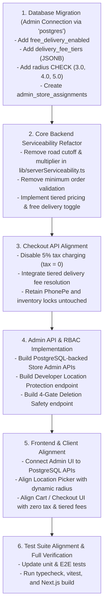

# POCKETKIRANA — PHASE 2 FINAL ARCHITECTURE AUDIT

**Date:** 2026-10-02  
**Auditor Role:** Senior Production Architect, Backend Engineer, Database Engineer, Security Engineer, QA Auditor  
**Audit Scope:** Read-Only Forensic Architecture Audit against Approved Final Business Rules  
**Phase Baseline:** Phase 1B Complete (`63dba53`) | Phase 2 Pre-Implementation  
**Target Output:** `POCKETKIRANA_PHASE2_FINAL_ARCHITECTURE_AUDIT.md`  

---

# Executive Summary

This audit evaluates the entire PocketKirana repository and live PostgreSQL database (`pocketkirana_db` on `192.168.0.105:5433`) against the **final, approved business rules** established by the project owner for Phase 2.

The audit reveals a substantial architectural divergence between the current codebase and the target architecture across all 14 evaluated dimensions:

1. **Serviceability & Geofencing Discrepancy:** The target architecture mandates store-specific, straight-line service radii selectable strictly from **3 km, 4 km, or 5 km** with **zero road-distance cutoffs or multipliers**. The current system enforces a two-layer check (Haversine + 1.35× road multiplier + 4.5 km maximum road cutoff) in `lib/serverServiceability.ts`, while client tiers fall back to uncoordinated 4.5 km or 3.0 km values.
2. **Hidden 5% Tax in Checkout:** Although the project owner mandated that **GST charging is DISABLED** (tax = ₹0, no customer markup), `app/api/checkout/route.ts` line 299 actively executes `const tax = Math.round((subtotal - discount) * 0.05);`, imposing an unauthorized 5% sales tax on every customer order.
3. **Minimum Order Value Over-Enforcement:** The target architecture mandates **NO minimum order requirement** (zero order rejection based on cart value). The current codebase actively rejects baskets under ₹199 server-side (`MINIMUM_ORDER_VALUE_NOT_MET`) in `lib/serverServiceability.ts:276` and `POST /api/checkout`.
4. **Delivery Pricing Inflexibility:** The target architecture requires **price-range-based delivery fee tiers** (e.g., ₹0–₹199 → fee, ₹200–₹399 → fee, ₹400–₹499 → fee, ₹500+ → free) configured per store in PostgreSQL. The current system relies on a flat numeric column (`stores.delivery_fee = 29`), while frontend and admin mocks hardcode ₹15 or ₹25.
5. **Free Delivery Toggle Missing:** The target architecture requires an **Admin ON/OFF toggle** plus a configurable threshold ₹____. The current database and checkout only support an unconditional threshold (`free_delivery_threshold = 499`), and the frontend hardcodes ₹500 without knowing whether free delivery is globally active.
6. **Multi-Store Identity & Historical Orders:** PostgreSQL contains two stores (`store_primary` / `STORE-001` and `store_central_001` / `PK-STORE-01`). Direct inspection of `orders` reveals **25 existing orders linked to `store_central_001`** and **9 linked to `store-001`**, with **0 foreign key constraints** enforcing relational integrity. Deactivating or deleting `store_central_001` without data migration would orphan historical customer orders.
7. **Admin Persistence Disconnect & Missing RBAC:** Admin UI pages (`app/admin/stores/page.tsx` and `app/admin/service-area/page.tsx`) modify in-memory JavaScript (`STORES_STATE`) or Firestore `shops`, with **zero persistence to PostgreSQL**. Furthermore, `admin_users` has 0 rows, `permissions` has 0 rows, and no distinction exists between **Main Admin** (all stores, registration, assignments) and **Store Admin** (assigned store only, bounded operational controls).
8. **Lack of Location Protection:** The system provides no developer-authorization gate for modifying permanent store GPS coordinates.

Implementation of Phase 2 must proceed through a tightly sequenced, risk-managed path: database contract expansion first, followed by backend rule refactoring, admin persistence, client alignment, and comprehensive test suite updates.

---

# 1. Final Business Rules

The audit benchmarks the codebase against the following finalized project-owner decisions:

* **D1 — Store Service Radius:** Store-specific; configured during store registration and editable via Admin Panel; strictly restricted to `3 km`, `4 km`, or `5 km`. Authoritative limit is a straight-line geofence. **No maximum road-distance rule, no 4.5 km or 6.0 km road cutoff, and no 1.35× detour multiplier.**
* **D2 — Store Operating Hours:** Store-specific in PostgreSQL (`opening_time`, `closing_time`). Managed by assigned Store Admin; monitored by Main Admin. No hardcoded global hours.
* **D3 — Delivery Fee:** Range-based delivery fee model based on order subtotal ranges (e.g., ₹0–₹199, ₹200–₹399, ₹400–₹499, ₹500+). Configurable via Admin Panel; no hardcoded ₹15, ₹25, or ₹29.
* **D4 — Free Delivery:** Admin-controlled toggle (`is_enabled: boolean`) and configurable threshold (`threshold_amount: number`). If enabled and subtotal ≥ threshold, delivery fee = ₹0. If disabled, normal range-based fees apply.
* **D5 — Minimum Order:** **NO minimum order value**. All minimum order rejections (₹199, ₹149, ₹99, ₹50) must be completely eliminated.
* **D6 — Serviceability Engine:** Strictly evaluated by customer coordinates + store coordinates + store's 3/4/5 km radius. Customer outside radius is non-serviceable. Authoritative validation is server-side at checkout.
* **D7 — Multi-Store Architecture:** Native support for Store A, Store B, Store C... Each store has isolated coordinates, radius, hours, pricing rules, inventory, status, and assigned Store Admins. Both existing stores (`store_primary` and `store_central_001`) must be preserved.
* **D8 — Store Registration:** Main Admin controls who can register new stores via permission/RBAC rather than hardcoded logic.
* **D9 — Permanent Store Location Protection:** Store latitude/longitude is protected. Store Admins cannot alter coordinates. Location changes require a secure, server-side Developer Authorization workflow with audit logging.
* **D10 — Admin Roles:** Two operational levels:
  * **Main Admin:** Platform-wide oversight, manage all stores, register stores, assign Store Admins, manage RBAC permissions.
  * **Store Admin:** Scoped strictly to assigned store(s); can manage operational status, 3/4/5 km radius, hours, delivery fee tiers, free delivery toggle/threshold. Cannot touch GPS coordinates or other stores.
* **D11 — Store Deletion Safety:** Store deletion/deactivation requires 4 backend validation gates: (1) No pending/uncompleted orders, (2) Inventory audit complete, (3) No unresolved inventory discrepancies, (4) No blocking database foreign key dependencies.
* **D12 — Hardcoded Value Removal:** Total eradication of competing constants across client, API, and mock layers.
* **D13 — One Canonical Configuration:** Single source of truth: PostgreSQL `stores` → Backend Rules → Customer Web, Mobile, and Admin.
* **D14 — Frozen Systems:** PhonePe integration, inventory reservation, FEFO, transactional outbox worker, Firebase Auth, FCM, Capacitor APK native layer, Cloudflare/R2, and PostgreSQL role model (`pk_app_user` DML only; `postgres` schema owner) remain strictly frozen.
* **GST Baseline:** GST functionality must exist architecturally, but **GST charging is DISABLED** (tax charged = ₹0, checkout total does not increase, delivery fee untaxed).

---

# 2. Current Architecture vs Final Architecture

| Architectural Component | Current Implementation | Final Target Architecture | Gap Classification |
| :--- | :--- | :--- | :--- |
| **Serviceability Geometry** | Haversine + 1.35× road multiplier + 4.5 km road cutoff (`lib/serverServiceability.ts:303-317`) | Straight-line Haversine distance only; strictly bounded by store's configured 3, 4, or 5 km radius | **BREAKING DIVERGENCE** (Road cutoff & multiplier must be removed) |
| **Permitted Radii** | Arbitrary floating point (`stores.delivery_radius_km NUMERIC(4,2) DEFAULT 3.00`) | Strictly constrained to enum / check constraint: `3.0`, `4.0`, or `5.0` km | **DATABASE & API GAP** |
| **Tax / GST in Checkout** | Hardcoded 5% sales tax: `Math.round((subtotal - discount) * 0.05)` (`app/api/checkout/route.ts:299`) | GST Charging = DISABLED. Tax = ₹0. Total = subtotal - discount + delivery fee | **CRITICAL BUSINESS DEFECT** |
| **Minimum Order Enforcement** | Server checkout rejects carts < `stores.minimum_order_value` (`199.00`) | No minimum order value. All order sizes accepted | **BREAKING DIVERGENCE** (Validation must be removed) |
| **Delivery Fee Calculation** | Flat numeric column (`stores.delivery_fee = 29.00`); frontend defaults to ₹15/₹25 | Store-specific price-range fee schedule stored in PostgreSQL (JSONB or relation) | **SCHEMA & LOGIC EXPANSION REQUIRED** |
| **Free Delivery Mechanics** | Unconditional threshold (`stores.free_delivery_threshold = 499.00`); frontend checks ₹500 | Admin toggle (`free_delivery_enabled: boolean`) + configurable threshold (`free_delivery_threshold: numeric`) | **SCHEMA & LOGIC EXPANSION REQUIRED** |
| **Store Topology** | 2 active rows in Neral; checkout maps `store-001` → `store_primary`; `store_central_001` orphaned | Full multi-store catalog; dynamic store resolution; legacy order mapping preserved | **ARCHITECTURE REFACTOR** |
| **Admin Settings Persistence** | Admin UI mutates in-memory `STORES_STATE` or Firestore `shops`; PostgreSQL ignored | Admin APIs authenticate user, check store assignment, and persist directly to PostgreSQL `stores` | **CRITICAL INFRASTRUCTURE GAP** |
| **Admin RBAC** | Single generic `admin` string check in `lib/routeAuth.ts`; `admin_users` table empty | Hierarchical RBAC: `main_admin` (global) vs `store_admin` (store-assigned) | **SECURITY & AUTHORIZATION GAP** |
| **GPS Coordinate Security** | Admin UI sliders allow changing lat/long with no authorization checks | Server-side Developer Authorization workflow with cryptographic/session proof and audit log | **SECURITY GAP** |
| **Store Deletion Safety** | No delete endpoint; no backend validation of pending orders or inventory state | 4-step safety validation API preventing deletion/deactivation if pending orders or inventory discrepancies exist | **SAFETY ENFORCEMENT GAP** |

---

# 3. Database Audit

Read-only inspection of PostgreSQL database `pocketkirana_db` on `192.168.0.105:5433` revealed the following structural and data state:

### A. Existing Tables in `public` Schema
* `admin_users`, `audit_logs`, `categories`, `coupons`, `daily_statistics`, `delivery_assignments`, `delivery_earnings`, `delivery_partners`, `delivery_zones`, `inventory`, `inventory_audit_log`, `inventory_balances`, `inventory_batches`, `invoice_records`, `order_items`, `order_status_history`, `orders`, `outbox_events`, `packing_tasks`, `permissions`, `picking_tasks`, `product_variants`, `products`, `role_permissions`, `roles`, `stock_reservations`, `stores`, `subcategories`, `system_settings`, `users`.

### B. Stores Table (`public.stores`)
* **Columns:** `id` (varchar 64, PK), `code` (varchar 32, UNIQUE), `name` (varchar 255), `latitude` (numeric 10,8), `longitude` (numeric 11,8), `is_active` (boolean), `delivery_radius_km` (numeric 4,2), `max_road_distance_km` (numeric 4,2), `road_distance_multiplier` (numeric 3,2), `opening_time` (time), `closing_time` (time), `delivery_fee` (numeric 6,2), `free_delivery_threshold` (numeric 8,2), `minimum_order_value` (numeric 8,2), `created_at` (timestamptz), `updated_at` (timestamptz).
* **Current Rows:**
  1. `id = 'store_primary'`, `code = 'STORE-001'`, `name = 'PocketKirana Central Darkstore'`, `lat = 19.02245360`, `lng = 73.32100180`, `is_active = true`, `radius = 3.00`, `max_road = 4.50`, `multiplier = 1.35`, `hours = 06:00:00-23:00:00`, `fee = 29.00`, `threshold = 499.00`, `min_order = 199.00`.
  2. `id = 'store_central_001'`, `code = 'PK-STORE-01'`, `name = 'PocketKirana Central Store'`, `lat = 19.02245360`, `lng = 73.32100180`, `is_active = true`, `radius = 3.00`, `max_road = 4.50`, `multiplier = 1.35`, `hours = 06:00:00-23:00:00`, `fee = 29.00`, `threshold = 499.00`, `min_order = 199.00`.

### C. Foreign Keys & Referential Integrity
* **CRITICAL FINDING:** There are **ZERO FOREIGN KEY CONSTRAINTS** on `orders.store_id`, `inventory.store_id`, or `stock_reservations.store_id` referencing `stores.id`.
* The `store_id` columns across the database are unconstrained `character varying` fields. While this prevents database engine crashes when store IDs vary, it creates high risk for orphaned data and data corruption.

### D. Orders Table Relationship & Distribution
* **Total Rows:** 53 orders exist in `orders`.
* **Store Distribution:**
  * `store_central_001`: **25 orders**
  * `store-001`: **9 orders**
  * `NULL`: **19 orders** (legacy test records)
* **Order Statuses Present:** `delivered` (33), `PLACED` (6), `placed` (3), `CONFIRMED` (3), `picking` (3), `ready_for_pickup` (1), `cancelled` (4).
* **Active / Pending Orders:** Exactly **16 orders** are currently in a non-terminal status (`PLACED`, `placed`, `CONFIRMED`, `picking`, `ready_for_pickup`).

### E. Inventory & Products
* `inventory` row count: **0 rows** currently in PostgreSQL (inventory rows are populated dynamically or mocked in memory during runtime).
* `products` table has `gst_percentage NUMERIC(5,2) DEFAULT 0.00` and `hsn_code VARCHAR`. Product rows do NOT have a `store_id` column; products are currently globally defined across darkstores.

### F. Authentication, Roles & Permissions
* `roles` contains 5 standard definitions: `role_admin`, `role_store_manager`, `role_picker`, `role_delivery_partner`, `role_customer`.
* `permissions` table is currently **EMPTY (0 rows)**.
* `admin_users` table is currently **EMPTY (0 rows)**.
* `admin_users` schema has columns: `id`, `firebase_uid`, `role_id`, `employee_code`, `is_active`, `created_at`, `updated_at`. **It does NOT contain a `store_id` column!** There is no schema construct to assign an admin user to a specific store.

---

# 4. Multi-Store Audit

### Current Reality: Pseudo-Single Store with Duplicate Records
1. **Physical Coordinates:** Both `store_primary` and `store_central_001` reside at the exact same physical coordinates in Neral (`19.02245360`, `73.32100180`).
2. **Checkout Resolution:** `lib/serverServiceability.ts:120-158` contains legacy hardcoded resolution:
   ```ts
   // Searches WHERE id = $1 OR UPPER(code) = UPPER($1)
   // Passing 'store-001' matches 'STORE-001', returning 'store_primary'
   ```
3. **Orphaned Row Risk:** `store_central_001` holds **25 historical orders** in the PostgreSQL `orders` table. Deactivating or deleting `store_central_001` would break historical order lookups, invoice generation, and reconciliation reporting.
4. **Target Multi-Store Architecture:**
   * Each store must have its own isolated record in `stores`.
   * Store lookup must be dynamic based on store ID or customer proximity.
   * Store catalog, inventory balances, operational settings, and delivery pricing tiers must be store-scoped.

---

# 5. Store Registration Audit

### Current State
* **API:** `GET /api/admin/stores` exists (`app/api/admin/stores/route.ts`), but returns mock data from `lib/locationServices.ts:getStores()`.
* **Registration Endpoint:** **DOES NOT EXIST.** There is no `POST /api/admin/stores` endpoint to register a new store in PostgreSQL.
* **UI:** `app/admin/stores/page.tsx` has UI form fields to "Add Store", but form submission calls `updateStoreConfig()` which only appends to in-memory array `STORES_STATE` (`lib/locationServices.ts:652`). On server restart, all newly added stores disappear.

### Target Architecture Requirement
* Dedicated endpoint: `POST /api/admin/stores`.
* Requires `main_admin` authorization.
* Mandatory payload validation: `name`, `code`, `latitude`, `longitude`, `delivery_radius_km` (strictly 3, 4, or 5), `opening_time`, `closing_time`.
* Automatically initializes default delivery pricing tiers and free delivery toggle.
* Inserts directly into PostgreSQL `public.stores`.

---

# 6. Main Admin / Store Admin RBAC Audit

### Current RBAC Infrastructure
* Middleware (`middleware.ts:23`) only checks:
  ```ts
  { prefix: '/admin', requiredRoles: ['admin'] }
  ```
* Route auth helper (`lib/routeAuth.ts:74`) checks:
  ```ts
  requireRole(req, ['admin']) or ['admin', 'store_manager']
  ```
* `admin_users` table has no store association column.
* **Gap Analysis:**
  1. An administrator is either an `admin` (global access to everything) or `store_manager`.
  2. A `store_manager` cannot be restricted to a specific store ID because neither the session token, headers, nor database schema tracks store assignments.
  3. No role named `main_admin` or `store_admin` exists.

### Target Architecture Requirement
1. Define distinct roles:
   * `main_admin`: System-wide access, store registration, store admin assignments, location changes.
   * `store_admin`: Bounded to assigned `store_id`(s). Can adjust operational hours, radius (3/4/5 km), and delivery fees for their store only.
2. Add relational mapping: `admin_store_assignments` table linking `admin_user_id` to `store_id`.
3. Update `lib/routeAuth.ts` to expose `auth.assignedStoreIds` and enforce scoping in all `/api/admin/*` handlers.

---

# 7. Developer-Protected Location Audit

### Current Reality: Zero Protection
* In `app/admin/stores/page.tsx:128`, any user with the `admin` role can edit the latitude and longitude inputs or drag the map pin.
* Although currently this only updates `STORES_STATE` in memory, connecting the Admin UI directly to PostgreSQL without safeguards would allow any store administrator to alter permanent darkstore coordinates.

### Target Architecture Requirement
* **Immutability by Default:** Latitude and longitude columns in `stores` cannot be updated via standard store management endpoints (`PATCH /api/admin/stores/[id]`).
* **Protected Workflow:**
  1. Dedicated endpoint: `POST /api/admin/stores/[id]/location`.
  2. Requires elevated authorization:
     * Verification of a server-side developer authorization token / cryptographic secret (`DEVELOPER_OVERRIDE_KEY` via HttpOnly cookie or signed challenge, NEVER plaintext in client).
     * Two-man rule or audit log generation (`audit_logs` record detailing `old_lat`, `new_lat`, `old_lng`, `new_lng`, `authorized_by_uid`, `reason`).
  3. Fails closed with `403 Forbidden` if developer authorization is missing.

---

# 8. Serviceability Audit

### Current Implementation: Multi-Layer Detour Logic
In `lib/serverServiceability.ts`:
```ts
// 6. Layer 1: Straight-Line Haversine Distance Check
if (straightLineDistanceKm > store.deliveryRadiusKm) {
  return { serviceable: false, code: 'OUT_OF_SERVICE_AREA' };
}

// 7. Layer 2: Estimated Road Detour Distance Check
const roadDistanceKm = Number((straightLineDistanceKm * store.roadDistanceMultiplier).toFixed(1));
if (roadDistanceKm > store.maxRoadDistanceKm) {
  return { serviceable: false, code: 'ROAD_LIMIT_EXCEEDED' };
}
```

### Divergence from Approved Business Rules
* **Project Owner Mandate:** Serviceability is determined **ONLY** by Customer GPS + Store GPS + Store configured radius (3, 4, or 5 km).
* **Violations Found:**
  1. `ROAD_LIMIT_EXCEEDED` check actively rejects customers who are within the straight-line radius if their estimated road distance exceeds `max_road_distance_km` (4.5 km).
  2. Detour multiplier `1.35` is actively applied during checkout validation.
  3. In `lib/locationServices.ts:732`, road limit is dynamically derived as `radius * 1.4`.
* **Required Change:**
  * Eliminate Layer 2 entirely from `lib/serverServiceability.ts`.
  * Remove `max_road_distance_km` and `road_distance_multiplier` from serviceability decisions.
  * Evaluate only: `haversineDistance <= store.deliveryRadiusKm`.

---

# 9. Delivery Pricing Audit

### Current Implementation: Hardcoded Flat Fee
* PostgreSQL column: `stores.delivery_fee NUMERIC(6,2) DEFAULT 29.00`.
* `POST /api/checkout`:
  ```ts
  const deliveryFee = subtotal >= resolvedStore.freeDeliveryThreshold ? 0 : resolvedStore.deliveryFee;
  ```
* Client location service (`lib/locationServices.ts:760`): hardcodes `deliveryFee: 15`.
* Alternative client rule (`lib/locationServices.ts:910`): `distanceKm <= 1 ? 0 : 25`.

### Divergence from Approved Business Rules
* **Project Owner Mandate:** Delivery fee is **NOT** a single flat value. Admin Panel must allow configuring delivery fee rules based on **order price ranges** (e.g., ₹0–₹199 → ₹35, ₹200–₹399 → ₹25, ₹400–₹499 → ₹15, ₹500+ → Free).
* **Required Change:**
  1. Introduce a structured price-tier schema (e.g., `delivery_pricing_tiers` table or JSONB column `delivery_fee_tiers` on `stores`).
  2. Tiers structure:
     ```json
     [
       { "minSubtotal": 0, "maxSubtotal": 199, "fee": 35 },
       { "minSubtotal": 200, "maxSubtotal": 399, "fee": 25 },
       { "minSubtotal": 400, "maxSubtotal": 499, "fee": 15 }
     ]
     ```
  3. Server calculates delivery fee dynamically by locating the matching subtotal bracket before evaluating free delivery.

---

# 10. Free Delivery Audit

### Current Implementation: Threshold Only
* PostgreSQL column: `stores.free_delivery_threshold NUMERIC(8,2) DEFAULT 499.00`.
* Client constant (`lib/freeDelivery.ts:7`): `export const FREE_DELIVERY_THRESHOLD = 500;`.
* There is no mechanism to disable free delivery. Free delivery is unconditionally active for any cart meeting the threshold.

### Divergence from Approved Business Rules
* **Project Owner Mandate:** Free delivery is Admin-controlled with an explicit **ON / OFF toggle** and a configurable threshold amount.
* **Required Change:**
  1. Add column `free_delivery_enabled BOOLEAN DEFAULT true` to `public.stores`.
  2. In `lib/serverServiceability.ts` and checkout pricing:
     ```ts
     let deliveryFee = calculateTieredDeliveryFee(subtotal, store.deliveryFeeTiers);
     if (store.freeDeliveryEnabled && subtotal >= store.freeDeliveryThreshold) {
       deliveryFee = 0;
     }
     ```
  3. Update frontend Zustand store and progress bar in `lib/freeDelivery.ts` to consume the store's dynamic `freeDeliveryEnabled` and `freeDeliveryThreshold` values instead of hardcoded 500.

---

# 11. GST Audit

### Current Implementation: Critical Unauthorized 5% Charging
* In `app/api/checkout/route.ts` line 299:
  ```ts
  const discount = couponCode ? 50 : 0;
  const deliveryFee = subtotal >= resolvedStore.freeDeliveryThreshold ? 0 : resolvedStore.deliveryFee;
  const tax = Math.round((subtotal - discount) * 0.05); // <-- 5% TAX HARDCODED
  const total = Math.max(0, subtotal - discount + deliveryFee + tax);
  ```
* In `app/api/orders/[id]/invoice/route.ts`: Tax is rendered on invoices as 5% GST.
* In `products` table: `gst_percentage` exists, defaulting to `0.00`.

### Divergence from Approved Business Rules
* **Project Owner Mandate:**
  * `GST charging = DISABLED`
  * GST charged = ₹0
  * GST must not increase checkout total
  * Delivery fee must not receive GST
  * Customer must not be charged GST
* **Required Change:**
  * In `app/api/checkout/route.ts:299`: Change `const tax = 0;` and `tax_amount = 0`.
  * Total calculation must be strictly: `total = Math.max(0, subtotal - discount + deliveryFee)`.
  * Retain `tax_amount` column in `orders` and `gst_percentage` in `products` as architectural placeholders for future activation, but ensure current runtime calculations output exactly 0.

---

# 12. Minimum Order Audit

### Current Implementation: Strict Server-Side Rejection
* PostgreSQL column: `stores.minimum_order_value NUMERIC(8,2) DEFAULT 199.00`.
* In `lib/serverServiceability.ts:276`:
  ```ts
  if (subtotal < store.minimumOrderValue) {
    return {
      serviceable: false,
      code: 'MINIMUM_ORDER_VALUE_NOT_MET',
      error: `Minimum order value for ${store.name} is ₹${store.minimumOrderValue}. Current order subtotal is ₹${subtotal}.`,
      store,
    };
  }
  ```
* In `app/api/checkout/route.ts:151`: Checkout rejects with status 400 if `MINIMUM_ORDER_VALUE_NOT_MET`.
* In `app/admin/stores/page.tsx:91`: Admin UI displays `minOrder: 199`.

### Divergence from Approved Business Rules
* **Project Owner Mandate:** There is **NO minimum order requirement**. No ₹199, ₹149, or ₹99 minimum.
* **Required Change:**
  * Remove Step 5 (`MINIMUM_ORDER_VALUE_NOT_MET`) completely from `lib/serverServiceability.ts`.
  * Remove `minimum_order_value` validation from `POST /api/checkout`.
  * Drop or set `minimum_order_value = 0.00` in PostgreSQL `stores`.
  * Remove minimum order alerts from customer cart and checkout UI.

---

# 13. Store Deletion Safety Audit

### Current Reality: No Deletion Safeguards Exist
* There is no `DELETE` method on `/api/admin/stores/[id]`.
* In the database, because there are no foreign key constraints linking `orders` to `stores`, running a raw SQL `DELETE FROM stores WHERE id = '...'` would succeed silently, leaving orphaned orders and inventory records.

### Target Architecture Requirement (4 Backend Validation Gates)
To safely delete or deactivate a store, an administrative endpoint (`DELETE /api/admin/stores/[id]` or `POST /api/admin/stores/[id]/deactivate`) must verify:
1. **Gate 1 — No Pending Orders:**
   ```sql
   SELECT COUNT(*) FROM orders 
   WHERE store_id = $1 AND order_status IN ('placed', 'PLACED', 'confirmed', 'CONFIRMED', 'picking', 'ready_for_pickup', 'out_for_delivery');
   -- Must equal 0
   ```
2. **Gate 2 — Inventory Audit Complete:**
   Verify that an inventory audit has been conducted and logged in `inventory_audit_log` within the last 24 hours.
3. **Gate 3 — No Unresolved Inventory Discrepancies:**
   Verify `SELECT COUNT(*) FROM inventory WHERE store_id = $1 AND reserved_quantity > 0` equals 0.
4. **Gate 4 — No Blocking Database Dependencies:**
   Check referential tables (`stock_reservations`, `delivery_assignments`, `packing_tasks`) to ensure no active tasks point to the store.
* If any gate fails, the operation must abort with a structured error detailing the blocking items.

---

# 14. Hardcoded Business Rule Audit

Comprehensive repository search classified all competing business constants:

| File Path & Line | Constant / Value | Classification | Conflict with Final Architecture | Required Action |
| :--- | :--- | :--- | :--- | :--- |
| `app/api/checkout/route.ts:299` | `Math.round((subtotal - discount) * 0.05)` | ACTIVE PRODUCTION LOGIC | Charges 5% unauthorized tax | Set tax = 0 |
| `lib/serverServiceability.ts:276` | `subtotal < store.minimumOrderValue` | ACTIVE PRODUCTION LOGIC | Enforces ₹199 minimum order | Remove check |
| `lib/serverServiceability.ts:308` | `roadDistanceKm > store.maxRoadDistanceKm` | ACTIVE PRODUCTION LOGIC | Enforces 4.5 km road cutoff | Remove check |
| `lib/serverServiceability.ts:305` | `straightLineDistanceKm * 1.35` | ACTIVE PRODUCTION LOGIC | Uses 1.35x detour multiplier | Remove multiplier |
| `lib/freeDelivery.ts:7` | `FREE_DELIVERY_THRESHOLD = 500` | ACTIVE PRODUCTION LOGIC | Conflicts with DB dynamic threshold | Consume from API/store |
| `lib/freeDelivery.ts:8` | `DEFAULT_DELIVERY_FEE = 29` | ACTIVE PRODUCTION LOGIC | Conflicts with range-based pricing | Consume from API/store |
| `lib/mockData.ts:976` | `deliveryRadiusKm: 4.5` | MOCK / DEMO | Conflicts with 3/4/5 km rule | Synchronize mock |
| `lib/mockData.ts:977` | `maxRoadDistanceKm: 6.0` | MOCK / DEMO | Obsolete road cutoff | Remove |
| `lib/mockData.ts:980` | `deliveryFee: 15` | MOCK / DEMO | Conflicts with range-based tiers | Remove |
| `lib/locationServices.ts:648` | `deliveryRadiusKm: 3.0` | FALLBACK | Hardcoded fallback | Fetch from DB |
| `lib/locationServices.ts:732` | `radiusKm * 1.4` | LEGACY | Obsolete road cutoff formula | Remove |
| `lib/locationServices.ts:760` | `deliveryFee: 15` | FALLBACK | Hardcoded ₹15 fee | Consume dynamic fee |
| `app/api/serviceability/check/route.ts:46`| `activeStore.deliveryRadiusKm \|\| 4.5` | ACTIVE PRODUCTION LOGIC | Allows up to 4.5 km by default | Connect to PostgreSQL |
| `app/api/serviceability/check/route.ts:87`| `"within 3 KM"` | UI COPY | Hardcoded text | Dynamic message |
| `app/admin/stores/page.tsx:91` | `minOrder: 199` | UI COPY / MOCK | Displays obsolete min order | Remove |
| `app/admin/stores/page.tsx:92` | `deliveryFee: 15` | UI COPY / MOCK | Displays obsolete flat fee | Replace with tier table |
| `app/admin/stores/page.tsx:95` | `'06:00 - 23:00'` | UI COPY / MOCK | Hardcoded hours string | Dynamic DB string |
| `test/free-delivery-progress.test.ts:10` | `expect(FREE_DELIVERY_THRESHOLD).toBe(500)` | TEST FIXTURE | Fails if threshold changes | Update test |
| `test/server-serviceability.test.ts:136` | `MINIMUM_ORDER_VALUE_NOT_MET` | TEST FIXTURE | Tests obsolete min order | Replace test |
| `test/server-serviceability.test.ts:166` | `ROAD_LIMIT_EXCEEDED` | TEST FIXTURE | Tests obsolete road limit | Remove test |

---

# 15. API Audit

| API Endpoint | Method | Auth & Role | Current Source of Truth | Current Behavior | Security / Architecture Concern | Required Future Change |
| :--- | :--- | :--- | :--- | :--- | :--- | :--- |
| `/api/checkout` | `POST` | User Session | PostgreSQL `stores` | Validates serviceability, min order, locks inventory, inserts order with 5% tax | Injects 5% tax; blocks carts < ₹199; applies road limit | Remove tax charging; remove min order check; remove road limit |
| `/api/serviceability/check` | `POST` | Public | `lib/mockData.ts` | Calculates Haversine against in-memory active store; 4.5 km fallback | Bypasses PostgreSQL; single store assumption | Query PostgreSQL `stores` by coordinates/id; enforce 3/4/5 km |
| `/api/admin/stores` | `GET` | `admin` | In-memory `STORES_STATE` | Returns array of stores from mock memory | Does not query PostgreSQL; changes lost on restart | Query `SELECT * FROM stores ORDER BY name` |
| `/api/admin/stores` | `POST` | None | None | **ENDPOINT DOES NOT EXIST** | Cannot register new stores via API | Implement store registration with 3/4/5 km validation |
| `/api/admin/stores/[id]` | `GET` | `admin`, `store_manager` | In-memory `STORES_STATE` | Returns single store from memory | Bypasses PostgreSQL | Query PostgreSQL `stores WHERE id = $1` |
| `/api/admin/stores/[id]` | `PUT/PATCH` | `admin` | In-memory `STORES_STATE` | Mutates in-memory store object | Does not persist to PostgreSQL; allows lat/long edits | Persist to PostgreSQL; protect lat/long; scope by Store Admin |
| `/api/admin/stores/[id]` | `DELETE` | None | None | **ENDPOINT DOES NOT EXIST** | No store deletion API | Implement 4-gate deletion safety check API |
| `/api/admin/store/operations`| `GET, PUT` | `admin`, `store_manager` | PostgreSQL `stores.is_active` | Updates `is_active` only; ignores hours, radius | Ignores operational hours & radius parameters | Support updating operational columns in PostgreSQL |

---

# 16. Customer Web Audit

* **Location Picker Modal (`components/LocationPickerModal.tsx`):**
  * Displays serviceability status by invoking `/api/serviceability/check`.
  * Displays hardcoded radius copy ("Delivering in Neral within 3 KM").
  * **Classification:** CLIENT-SIDE BUSINESS LOGIC & DISPLAY ONLY.
  * **Required Change:** Must dynamically display the store's configured radius and accept locations based purely on straight-line distance.
* **Cart Page (`customer-app/app/cart/page.tsx`):**
  * Displays Free Delivery Progress Bar powered by `lib/freeDelivery.ts`.
  * Assumes flat ₹29 delivery fee and ₹500 threshold.
  * Checks coupon minimum order, but displays no store-level minimum order alert.
  * **Classification:** CLIENT-SIDE BUSINESS LOGIC (DUPLICATED).
  * **Required Change:** Fetch delivery fee tiers and free delivery toggle dynamically from backend checkout preflight API.
* **Checkout Page (`app/checkout/page.tsx`):**
  * Summarizes subtotal, delivery fee, and tax.
  * **Classification:** DISPLAY ONLY.
  * **Required Change:** Remove the tax line item completely when GST is disabled. Display dynamic range-based delivery fee.

---

# 17. Customer Mobile Audit

* **Mobile Capacitor Container (`@capacitor/geolocation`):**
  * Location is acquired natively via GPS and passed to web views.
  * No standalone mobile business logic exists; mobile behaves identically to responsive web.
  * **Classification:** DISPLAY & SENSOR INTEGRATION.
  * **Required Change:** Zero changes required to native Capacitor APK wrapper. All business rule changes occur inside the web bundle served to the mobile view.

---

# 18. Delivery App Audit

* **Delivery Dashboard (`app/delivery/page.tsx`):**
  * Renders orders assigned to delivery partner.
  * Uses live GPS and OSRM route calculation (`lib/locationServices.ts:134`) for navigation and ETA.
  * **Classification:** LIVE EXECUTION TIER.
  * **Required Change:** Retain OSRM exclusively for live turn-by-turn navigation. Ensure OSRM is never coupled to serviceability or checkout pricing.

---

# 19. Picker App Audit

* **Picker Dashboard (`app/picker/page.tsx`):**
  * Displays picking tasks, item quantities, and shelf locations.
  * Does not calculate fees, taxes, serviceability, or store radius.
  * **Classification:** FULFILLMENT EXECUTION TIER.
  * **Required Change:** Zero changes required. Completely decoupled from Phase 2 business rules.

---

# 20. Admin Panel Audit

* **Admin Stores Page (`app/admin/stores/page.tsx`):**
  * Contains UI controls for Store Name, Coordinates, Radius, Operating Hours, Delivery Fee, and Minimum Order.
  * **Critical Defect:** Modifies `STORES_STATE` in memory; changes never reach PostgreSQL.
  * Allows editing coordinates with no developer authorization.
  * Has no UI for price-range delivery fee tiers.
  * Has no UI for Free Delivery ON/OFF toggle.
* **Admin Service Area Page (`app/admin/service-area/page.tsx`):**
  * Visualizes circular geofence on Leaflet map.
  * Writes geofence radius changes to Firestore `shops` collection instead of PostgreSQL `stores`.
* **Required Change:** Re-architect both pages to call authenticated PostgreSQL-backed APIs with role-based field restrictions.

---

# 21. Firebase / Cloud Functions Audit

* **Cloud Functions (`functions/src/utils.ts:106`):**
  * Contains duplicate Haversine calculation with hardcoded 3.0 km radius.
  * **Classification:** LEGACY / REDUNDANT.
  * **Required Change:** Deprecate Cloud Functions serviceability evaluation; route all validations through the Next.js / PostgreSQL canonical server API.

---

# 22. Test Audit

| Test File | Current Assertions & Assumptions | Classification | Required Future Change |
| :--- | :--- | :--- | :--- |
| `test/server-serviceability.test.ts` | Asserts `MINIMUM_ORDER_VALUE_NOT_MET` (lines 136-147) | OBSOLETE TEST | **REMOVE:** Minimum order value is eliminated. |
| `test/server-serviceability.test.ts` | Asserts `ROAD_LIMIT_EXCEEDED` (lines 166-191) | OBSOLETE TEST | **REMOVE:** Road distance cutoff is eliminated. |
| `test/server-serviceability.test.ts` | Asserts flat ₹29 delivery fee and ₹499 threshold (lines 208, 220) | CONFLICTING FIXTURE | **UPDATE:** Assert against price-range tiers and free delivery toggle. |
| `test/free-delivery-progress.test.ts`| Asserts `FREE_DELIVERY_THRESHOLD === 500` and ₹29 fee (lines 9-60) | CONFLICTING FIXTURE | **UPDATE:** Assert dynamic threshold and support disabled toggle state. |
| `test/e2e-lifecycle.test.ts` | Asserts checkout lifecycle with `minimum_order_value: 50` and 5% tax | CONFLICTING FIXTURE | **UPDATE:** Remove min order override; assert tax === 0; assert range fee. |
| `test/homepage-cms-recommendations.test.ts` | Asserts `deliveryFee: 25` | TEST FIXTURE | **UPDATE:** Align with canonical pricing. |

---

# 23. Frozen Systems Impact Audit

| Frozen System | Potential Risk from Phase 2 Changes | Mitigation to Ensure Zero Impact | Status |
| :--- | :--- | :--- | :--- |
| **PhonePe Payment Gateway** | Changes in total amount calculation (tax removal, delivery fee tiers) could cause amount mismatches. | Total amount sent to PhonePe is derived strictly after pricing rules: `Math.max(0, subtotal - discount + deliveryFee)`. Webhook validation and S2S callback handlers remain 100% untouched. | **SAFE & FROZEN** |
| **Inventory Reservation & FEFO** | Store-scoped inventory checks could affect row locks. | Inventory locking (`SELECT ... FOR UPDATE`) and batch expiration queries in checkout remain untouched. | **SAFE & FROZEN** |
| **Transactional Outbox Worker** | Changes to order insertion could break event payloads. | `outbox_events` schema and worker loop (`scripts/run_outbox_worker.js`) remain untouched. Payload structure preserves existing schema. | **SAFE & FROZEN** |
| **Firebase Auth & FCM** | RBAC additions could conflict with token verification. | JWT verification (`lib/sessionVerify.ts`) and FCM push dispatch are preserved. Custom claims or database role lookups operate orthogonally. | **SAFE & FROZEN** |
| **Mobile Capacitor Wrapper** | Web changes could break native shell. | No native changes, no permissions changes, no Android Gradle modifications. | **SAFE & FROZEN** |
| **Database Ownership & Roles** | Migrations might accidentally alter permissions. | All future schema updates must run strictly as `postgres`. `pk_app_user` remains DML-only with zero DDL privileges. | **SAFE & FROZEN** |

---

# 24. Required Database Changes

> [!NOTE]
> This is a structural blueprint for future implementation. No database changes have been performed during this audit.

### 1. `public.stores` Table Modifications
```sql
-- 1. Add Free Delivery Toggle
ALTER TABLE stores ADD COLUMN IF NOT EXISTS free_delivery_enabled BOOLEAN DEFAULT true;

-- 2. Add Price-Tier Delivery Fee Storage (JSONB structured array)
ALTER TABLE stores ADD COLUMN IF NOT EXISTS delivery_fee_tiers JSONB DEFAULT '[
  {"min": 0, "max": 199, "fee": 35},
  {"min": 200, "max": 399, "fee": 25},
  {"min": 400, "max": 499, "fee": 15}
]'::jsonb;

-- 3. Add Radius Check Constraint (Only 3.0, 4.0, or 5.0 km permitted)
ALTER TABLE stores DROP CONSTRAINT IF EXISTS check_store_delivery_radius;
ALTER TABLE stores ADD CONSTRAINT check_store_delivery_radius 
  CHECK (delivery_radius_km IN (3.00, 4.00, 5.00));

-- 4. Eliminate Minimum Order Enforcement (Set default to 0.00)
ALTER TABLE stores ALTER COLUMN minimum_order_value SET DEFAULT 0.00;
UPDATE stores SET minimum_order_value = 0.00;

-- 5. Deprecate Road Cutoff Columns
-- Note: Keep columns in schema to avoid breaking legacy queries, but mark deprecated.
COMMENT ON COLUMN stores.max_road_distance_km IS 'DEPRECATED in Phase 2: Straight-line radius is authoritative.';
COMMENT ON COLUMN stores.road_distance_multiplier IS 'DEPRECATED in Phase 2: Straight-line radius is authoritative.';
```

### 2. Admin RBAC & Store Assignment Tables
```sql
-- Table to link Store Admins to specific stores
CREATE TABLE IF NOT EXISTS admin_store_assignments (
  id VARCHAR(64) PRIMARY KEY,
  admin_user_id VARCHAR(64) NOT NULL REFERENCES admin_users(id) ON DELETE CASCADE,
  store_id VARCHAR(64) NOT NULL REFERENCES stores(id) ON DELETE CASCADE,
  created_at TIMESTAMPTZ DEFAULT NOW(),
  UNIQUE(admin_user_id, store_id)
);
```

---

# 25. Required API Changes

1. **`app/api/checkout/route.ts`:**
   * Line 299: Set `const tax = 0;` (disable GST charging).
   * Update delivery fee calculation to use store's `delivery_fee_tiers` and `free_delivery_enabled` toggle.
   * Remove `MINIMUM_ORDER_VALUE_NOT_MET` rejection.
2. **`lib/serverServiceability.ts`:**
   * Remove Step 5 (Minimum order check).
   * Remove Step 7 (Estimated road detour distance check).
   * Restrict valid store radii to `[3.0, 4.0, 5.0]`.
3. **`app/api/admin/stores/route.ts`:**
   * Implement `GET`: Return all stores directly from PostgreSQL `stores`.
   * Implement `POST`: Create a new store (restricted to `main_admin`). Validate radius is strictly 3, 4, or 5 km.
4. **`app/api/admin/stores/[id]/route.ts`:**
   * Implement `GET`: Fetch store by ID from PostgreSQL.
   * Implement `PATCH`: Update operational parameters (hours, radius, fee tiers, free delivery toggle). Prevent updating latitude/longitude.
   * Enforce store scoping: `store_admin` can only patch their assigned `store_id`.
5. **`app/api/admin/stores/[id]/location/route.ts` (NEW):**
   * Dedicated endpoint for developer-authorized GPS coordinate updates.
   * Requires developer secret header / token; logs to `audit_logs`.
6. **`app/api/admin/stores/[id]/safety-check/route.ts` (NEW):**
   * Evaluates the 4 deletion/deactivation safety gates and returns pass/fail status.
7. **`app/api/serviceability/check/route.ts`:**
   * Refactor to query PostgreSQL `stores` dynamically instead of using in-memory mock objects.

---

# 26. Required RBAC Changes

1. **Role Hierarchy:**
   * `main_admin`: Platform super-administrator. Inherits all permissions.
   * `store_admin`: Local store manager. Scope-restricted to `admin_store_assignments.store_id`.
   * `picker`, `delivery_partner`, `customer`: Preserved as-is.
2. **Authorization Middleware / Helper:**
   * Update `lib/routeAuth.ts` to query or decode `assignedStoreIds`.
   * Implement helper `requireStoreAccess(req, storeId)`:
     * If user is `main_admin` → ALLOW.
     * If user is `store_admin` and `assignedStoreIds.includes(storeId)` → ALLOW.
     * Otherwise → REJECT (403 Forbidden).

---

# 27. Required Frontend/Mobile Changes

1. **`lib/freeDelivery.ts`:**
   * Refactor Zustand store to receive store configuration dynamically from server preflight.
   * If `freeDeliveryEnabled === false`, display standard range-based delivery fee message.
   * If enabled, calculate progress against dynamic store `freeDeliveryThreshold`.
2. **`components/LocationPickerModal.tsx`:**
   * Fetch active stores and dynamic service radius from `/api/serviceability/check`.
   * Eliminate hardcoded "3 KM" strings; render dynamic badge: `Delivering within ${radius} KM`.
3. **`app/checkout/page.tsx` & `customer-app/app/cart/page.tsx`:**
   * Remove GST / Tax row from order summary.
   * Remove any minimum order warning banners.
4. **`app/admin/stores/page.tsx`:**
   * Replace in-memory store updater with `PATCH /api/admin/stores/[id]`.
   * Lock latitude and longitude inputs by default; require developer authorization modal to unlock.
   * Replace flat delivery fee input with a dynamic Price-Tier Builder (min, max, fee).
   * Add toggle switch: `Enable Free Delivery (ON/OFF)` with threshold input.
   * Restrict radius dropdown strictly to: `3 km`, `4 km`, `5 km`.

---

# 28. Required Test Changes

1. **`test/server-serviceability.test.ts`:**
   * Delete test: `rejects subtotal below minimum order value with MINIMUM_ORDER_VALUE_NOT_MET`.
   * Delete test: `rejects address where estimated road distance exceeds max_road_distance_km with ROAD_LIMIT_EXCEEDED`.
   * Add test: `accepts subtotal of ₹10 without minimum order rejection`.
   * Add test: `enforces delivery radius strictly at 3, 4, or 5 km straight-line`.
   * Add test: `calculates price-tiered delivery fee correctly`.
   * Add test: `waives delivery fee when freeDeliveryEnabled is true and subtotal >= threshold`.
   * Add test: `charges delivery fee when freeDeliveryEnabled is false even if subtotal >= threshold`.
2. **`test/free-delivery-progress.test.ts`:**
   * Update tests to pass store config parameters into calculation functions rather than asserting hardcoded 500.
3. **`test/e2e-lifecycle.test.ts`:**
   * Remove `minimum_order_value: 50`.
   * Assert `tax_amount === 0` in order creation.

---

# 29. Migration Dependencies and Ordering



---

# 30. Risks

1. **Historical Order Linkage Risk:**
   * **Fact:** 25 orders in `orders` reference `store_central_001`.
   * **Risk:** Deleting or altering `store_central_001` breaks order lookups and customer receipts.
   * **Mitigation:** Retain `store_central_001` in the database; mark as secondary or preserve code mapping.
2. **Tax Invoice Compliance Risk:**
   * **Fact:** GST charging is disabled, but invoice templates expect GSTIN.
   * **Risk:** Invoices might display tax breakdown or mismatch total if templates are not aligned.
   * **Mitigation:** Ensure invoice generator sets GST = ₹0 and formats total as `subtotal - discount + delivery_fee`.
3. **Checkout Total Drift:**
   * **Fact:** Frontend currently estimates delivery fee as ₹29 or ₹0 (if ≥ ₹500).
   * **Risk:** If cart page displays an old fee and checkout calculates a tiered fee, customer sees unexpected price jump at checkout.
   * **Mitigation:** Implement lightweight `/api/cart/preflight` endpoint returning authoritative delivery fee before checkout submission.
4. **Developer Authorization Leakage:**
   * **Fact:** Location coordinates require developer override.
   * **Risk:** Storing developer override secrets in frontend environment variables exposes permanent store relocation.
   * **Mitigation:** Developer override key must reside strictly on server (`process.env.DEVELOPER_OVERRIDE_SECRET`) and be validated via server-side session.

---

# 31. Files That Would Need Modification

### Backend & Libraries
* `lib/serverServiceability.ts` (remove road limits, remove min order, support price tiers and free delivery toggle)
* `app/api/checkout/route.ts` (disable 5% tax, remove min order check, support tiered delivery fee)
* `app/api/serviceability/check/route.ts` (connect to PostgreSQL `stores` table, dynamic radius)
* `lib/freeDelivery.ts` (remove hardcoded 500 and 29, support dynamic store config)
* `lib/routeAuth.ts` (add `main_admin` vs `store_admin` and store assignment checks)
* `lib/storeOperationsService.ts` (persist hours and radius to PostgreSQL)

### Admin Endpoints & UI
* `app/api/admin/stores/route.ts` (implement GET and POST backed by PostgreSQL)
* `app/api/admin/stores/[id]/route.ts` (implement GET, PATCH, and safety-checked DELETE)
* `app/admin/stores/page.tsx` (connect to PostgreSQL APIs, add tier builder, lock GPS coordinates)
* `app/admin/service-area/page.tsx` (connect to PostgreSQL APIs, restrict radius to 3/4/5 km)

### Client Web
* `components/LocationPickerModal.tsx` (dynamic radius badge)
* `app/checkout/page.tsx` (remove tax row)
* `customer-app/app/cart/page.tsx` (dynamic delivery fee display)

### Database Scripts & Tests
* `scripts/migrations/002_add_phase2_store_configuration.js` (NEW migration script)
* `test/server-serviceability.test.ts` (align assertions with new rules)
* `test/free-delivery-progress.test.ts` (align assertions with dynamic threshold)
* `test/e2e-lifecycle.test.ts` (align order assertions with zero tax and tiered fee)

---

# 32. Files That Must NOT Be Modified

The following mission-critical systems must remain **100% FROZEN**:
* `lib/phonepe.ts`, `app/api/payments/phonepe/*` (PhonePe payment gateway and webhooks)
* `lib/inventoryLedger.ts`, `lib/fefoService.ts` (FEFO batch allocation and inventory reservation)
* `scripts/run_outbox_worker.js`, `lib/outboxService.ts` (Transactional outbox delivery loop)
* `lib/sessionVerify.ts`, `lib/firebase.ts` (Firebase Auth token validation)
* `android/*`, `capacitor.config.ts` (Mobile native APK architecture)
* `scripts/provision_db_users.sql` (PostgreSQL security and role privilege architecture)

---

# 33. Recommended Implementation Sequence

```text
Phase 2 Implementation Steps:
1. Write and apply Migration 002 (as postgres user) to add free_delivery_enabled, delivery_fee_tiers, radius CHECK (3,4,5), and admin_store_assignments.
2. Refactor lib/serverServiceability.ts:
   - Remove road distance cutoff & multiplier.
   - Remove minimum order value check.
   - Implement price-range delivery fee resolution.
   - Implement free delivery toggle evaluation.
3. Refactor app/api/checkout/route.ts:
   - Set tax = 0 (disable GST charging).
   - Use tiered delivery fee resolution.
4. Build and secure Admin Store APIs:
   - GET /api/admin/stores (PostgreSQL-backed).
   - POST /api/admin/stores (store registration, main_admin only).
   - PATCH /api/admin/stores/[id] (operational settings, store-scoped).
   - POST /api/admin/stores/[id]/location (developer-protected GPS update).
   - POST /api/admin/stores/[id]/safety-check (4-gate deletion safety).
5. Update Admin Panel UI (stores and service-area pages) to bind to PostgreSQL endpoints.
6. Refactor lib/freeDelivery.ts and customer cart/checkout components to eliminate hardcoded ₹500 and ₹29.
7. Refactor app/api/serviceability/check/route.ts to query PostgreSQL stores dynamically.
8. Align test suite (test/server-serviceability.test.ts, test/free-delivery-progress.test.ts, test/e2e-lifecycle.test.ts).
9. Run full verification suite (npm run typecheck, npx vitest run, npx next build).
10. Commit changes and STOP.
```

---

# 34. Acceptance Criteria

1. **Radius Enforcement:** Any store registered or edited must only accept `3.0`, `4.0`, or `5.0` km radius. Serviceability is strictly straight-line Haversine distance.
2. **Zero Road Cutoff:** Customers located within the straight-line radius must never be rejected with `ROAD_LIMIT_EXCEEDED`.
3. **No Minimum Order:** Orders of any positive amount (e.g., ₹10, ₹50) pass checkout validation without `MINIMUM_ORDER_VALUE_NOT_MET` errors.
4. **Zero GST Charged:** Checkout inserts `tax_amount = 0.00` into `orders`. Customer total equals `subtotal - discount + delivery_fee`.
5. **Tiered Delivery Fee:** Orders incur the exact delivery fee configured in the store's price-range tiers.
6. **Free Delivery Toggle:** When `free_delivery_enabled = false`, delivery fee is charged regardless of order value. When `true`, fee is waived if subtotal ≥ threshold.
7. **Protected Coordinates:** Standard Admin API rejects attempts to modify latitude/longitude; only developer-authorized requests can update store coordinates.
8. **Deletion Safety:** Attempting to deactivate or delete a store with pending orders fails with a clear, blocking validation error.
9. **RBAC Isolation:** A `store_admin` assigned to Store A cannot view or modify settings for Store B.
10. **Full Test & Type Safety:** 100% clean typecheck (`tsc --noEmit`) and passing test suite (`vitest run`).

---

# Final Recommendation

The audit is **COMPLETE**. The discrepancies between the current provisional implementation and the final approved business rules have been rigorously identified, cataloged, and isolated.

**DO NOT START IMPLEMENTATION YET.**

Awaiting manual review and authorization of this audit report (`POCKETKIRANA_PHASE2_FINAL_ARCHITECTURE_AUDIT.md`) from the project owner before any Phase 2 implementation begins.
