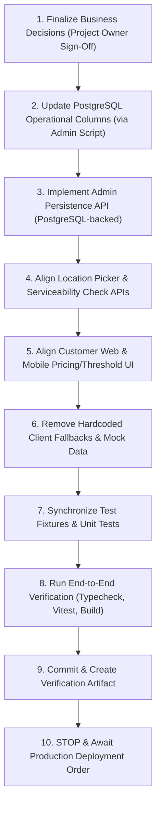

# POCKETKIRANA — PHASE 2 READ-ONLY BUSINESS-RULE & CONFIGURATION AUDIT

**Date:** 2026-10-02  
**Auditor Role:** Senior Production Architect, Backend Engineer, Database Engineer, Security Engineer, QA Auditor  
**Audit Scope:** Read-Only Business-Rule & Configuration System Forensic Audit  
**Phase Baseline:** Phase 1B Complete (`63dba53`) | Phase 2 Unstarted  

---

## 1. Executive Summary

The PocketKirana codebase is **internally inconsistent across multiple operational, pricing, and serviceability dimensions**. 

While Phase 1B successfully established a strict, server-side canonical serviceability and pricing gate at `POST /api/checkout` backed by PostgreSQL (`stores` table), the surrounding ecosystem (Frontend Web, Mobile Location Picker, Mock Data Stores, Admin Dashboard, and Firestore / Cloud Functions) remains in a **split-brain state**:

1. **Service Radius Split-Brain:** PostgreSQL enforces a **3.0 km** radius, but mock data, customer location pickers, and legacy serviceability APIs reference **4.5 km**, while pilot documentation and operational scripts declare **5.0 km**.
2. **Pricing Discrepancies:** Checkout enforces **₹29** delivery fee from PostgreSQL, while frontend location pickers and admin UI mock states advertise **₹15** or a distance-banded **₹25**.
3. **Threshold Inconsistency:** PostgreSQL and Checkout require **₹499** for free delivery, whereas the frontend Zustand store and progress bar celebrate at **₹500** (a 1-rupee gap leading to confusing customer UI state).
4. **Operating Hours Mismatch:** PostgreSQL and Checkout enforce **06:00–23:00**, while operational runbooks state **07:00–22:00**, and Step 2 Change Plans prescribe **10:00–22:00**.
5. **Admin Persistence Disconnect:** The Admin Store Management and Service Area pages (`app/admin/stores/page.tsx` and `app/admin/service-area/page.tsx`) modify in-memory JavaScript state (`STORES_STATE`) or Firestore documents, with **zero persistence to PostgreSQL**. Changes made by administrators in the UI have no effect on actual checkout validation.
6. **Store Identity Duplication:** Two store records exist in PostgreSQL (`store_primary` with code `STORE-001` and `store_central_001` with code `PK-STORE-01`), both pointing to the exact same physical coordinates in Neral. Checkout explicitly resolves `store-001` to `store_primary`, leaving `store_central_001` orphaned.

The system cannot safely enter production until the Project Owner resolves these core business decisions and a synchronization pass aligns the frontend, admin, and background tiers with the PostgreSQL source of truth.

---

## 2. Baseline Verification

| Attribute | Verified Status |
| :--- | :--- |
| **Git Branch** | `fix/page-readiness-production` |
| **Commit Hash** | `63dba5363579334b67e4ac9a401d94060be244bf` |
| **Commit Message** | `feat: enforce canonical server-side serviceability` |
| **Tracked Working Tree** | Clean (`git status --short` shows no modifications to tracked files) |
| **PostgreSQL Host** | `192.168.0.105` |
| **PostgreSQL Port** | `5433` |
| **PostgreSQL Database** | `pocketkirana_db` |
| **Runtime DML Role** | `pk_app_user` |
| **Database Ownership** | `postgres` (superuser / schema owner) |
| **Deployment State** | Local developer/client workstation runtime; NO active VPS |

---

## 3. Decision Register

| # | Dimension / Decision | Current Values Found | Evidence & Locations | Decision Required |
| :- | :--- | :--- | :--- | :--- |
| **D1** | **Final Neral Service Radius** | • `3.0 km`<br>• `4.5 km`<br>• `5.0 km` | • `3.0 km`: PostgreSQL `stores.delivery_radius_km`, `lib/serverServiceability.ts:174`, `lib/locationServices.ts:648, 726`, `functions/src/utils.ts:106`<br>• `4.5 km`: `lib/mockData.ts:976`, `lib/locationServices.ts:922`, `app/api/serviceability/check/route.ts:46`<br>• `5.0 km`: `lib/storeOperationsService.ts:76`, `docs/PHASE_20_CONTROLLED_PILOT.md:15` | **DECISION REQUIRED: FINAL SERVICE RADIUS**<br>Confirm exact straight-line geofence radius for Neral darkstore (3.0 km vs 4.5 km vs 5.0 km). |
| **D2** | **Final Shop Operating Hours** | • `06:00 – 23:00`<br>• `06:00 – 23:30`<br>• `07:00 – 22:00`<br>• `10:00 – 22:00` | • `06:00–23:00`: PostgreSQL `stores` table, `lib/serverServiceability.ts:177-178`, `lib/mockData.ts:974`, `app/admin/stores/page.tsx:95`<br>• `06:00–23:30`: `scripts/test_store_operations.js:65`, `lib/storeOperationsService.ts:75`<br>• `07:00–22:00`: `OPERATIONS_RUNBOOK.md:34`<br>• `10:00–22:00`: `POCKETKIRANA_STEP2_CHANGE_PLAN.md:176, 236, 273, 317, 454` | **DECISION REQUIRED: FINAL OPERATING HOURS**<br>Confirm actual opening and closing time in IST (06:00–23:00 vs 07:00–22:00 vs 10:00–22:00). |
| **D3** | **Final Delivery Fee Model** | • `₹29`<br>• `₹15`<br>• `₹25`<br>• `₹0` (waived) | • `₹29`: PostgreSQL `stores.delivery_fee`, `lib/serverServiceability.ts:179`, `lib/freeDelivery.ts:8`, `app/api/checkout/route.ts:296`<br>• `₹15`: `lib/locationServices.ts:760, 939`, `app/admin/stores/page.tsx:92`<br>• `₹25`: `lib/locationServices.ts:910` (if distance > 1km), `test/homepage-cms-recommendations.test.ts:195` | **DECISION REQUIRED: FINAL DELIVERY FEE MODEL**<br>Confirm flat fee (₹29 vs ₹15) or dynamic distance-banded fee. |
| **D4** | **Final Free-Delivery Threshold** | • `₹499`<br>• `₹500`<br>• `₹199`<br>• `₹99` | • `₹499`: PostgreSQL `stores.free_delivery_threshold`, `lib/serverServiceability.ts:180`, `app/api/checkout/route.ts:295`<br>• `₹500`: `lib/freeDelivery.ts:7`, `test/free-delivery-progress.test.ts:106`<br>• `₹199`: `docs/PHASE_20_CONTROLLED_PILOT.md`<br>• `₹99`: Early customer mocks | **DECISION REQUIRED: FINAL FREE-DELIVERY THRESHOLD**<br>Confirm whether threshold is ₹499 or ₹500, aligning DB and frontend celebration UI. |
| **D5** | **Final Minimum Order Value** | • `₹199`<br>• `₹149`<br>• `₹99`<br>• `₹50` | • `₹199`: PostgreSQL `stores.minimum_order_value`, `lib/serverServiceability.ts:181`, `app/admin/stores/page.tsx:91`<br>• `₹149`: Early pilot documentation<br>• `₹99`: Early customer app mocks<br>• `₹50`: E2E test fixture in `test/e2e-lifecycle.test.ts:28` | **DECISION REQUIRED: FINAL MINIMUM ORDER VALUE**<br>Confirm minimum checkout basket amount required before an order is accepted. |
| **D6** | **Final Maximum Road Distance** | • `4.5 km`<br>• `6.0 km`<br>• Derived (`radius * 1.4`) | • `4.5 km`: PostgreSQL `stores.max_road_distance_km`, `lib/serverServiceability.ts:175`<br>• `6.0 km`: `lib/mockData.ts:977`<br>• `radius * 1.4`: `lib/locationServices.ts:732` | **DECISION REQUIRED: FINAL MAXIMUM ROAD DISTANCE**<br>Confirm whether road cutoff is fixed at 4.5 km, 6.0 km, or mathematically derived. |
| **D7** | **Final Road-Distance Multiplier** | • `1.35`<br>• `1.40` | • `1.35`: PostgreSQL `stores.road_distance_multiplier`, `lib/serverServiceability.ts:176`, `lib/locationServices.ts:82, 152, 730`<br>• `1.40`: `lib/locationServices.ts:732` | **DECISION REQUIRED: FINAL ROAD-DISTANCE MULTIPLIER**<br>Confirm canonical detour approximation factor for Neral geography (1.35 vs 1.40). |
| **D8** | **OSRM Routing Policy** | • Deterministic multiplier at Checkout<br>• Asynchronous / Fallback for live tracking | • Checkout: pure math (`dist * multiplier <= maxRoadKm`) in `lib/serverServiceability.ts`<br>• Live tracking: OSRM public API with 4.5s timeout in `lib/locationServices.ts:134` | **DECISION REQUIRED: OSRM ROUTING POLICY**<br>Confirm that checkout remains 100% deterministic (no external HTTP dependency) and OSRM is strictly reserved for live rider navigation/tracking. |
| **D9** | **Admin Operational Settings** | • In-memory / Firestore only | • `app/admin/stores/page.tsx:128` (`updateStoreConfig`) updates `STORES_STATE` only<br>• `app/admin/service-area/page.tsx:78` writes to Firestore `shops`<br>• `app/api/admin/store/operations/route.ts` only writes `is_active` to PostgreSQL | **DECISION REQUIRED: ADMIN PERSISTENCE ARCHITECTURE**<br>Confirm requirement to build canonical admin API that persists operational changes directly to PostgreSQL. |
| **D10** | **Platform Owner vs Admin Roles** | • Single `admin` role | • `lib/auth.ts`, `middleware.ts`<br>• Ordinary store admins currently have UI access to adjust lat/lng, radius, and operational hours | **DECISION REQUIRED: PLATFORM OWNER RBAC**<br>Define permission boundary: darkstore manager can toggle store open/close pause; only Platform Owner can alter coordinates, radius, and fees. |
| **D11** | **Two-Store PostgreSQL Topology** | • `store_primary` (`STORE-001`)<br>• `store_central_001` (`PK-STORE-01`) | • PostgreSQL `stores` table (both active, identical Neral coordinates: 19.02245360, 73.32100180)<br>• `lib/serverServiceability.ts:121-125` resolves `store-001` to `store_primary` | **DECISION REQUIRED: STORE IDENTIFIER CONSOLIDATION**<br>Decide whether to deprecate `store_central_001` and formalize `store_primary` as the single canonical store ID for Phase 2. |
| **D12** | **Contradictory Hardcoded Values** | • Multiple conflicting UI and fallback values | • Detailed inventory in Section 6 | **DECISION REQUIRED: HARDCODED FALLBACK REMOVAL**<br>Approve migration of client and API layers to fetch operational settings dynamically from PostgreSQL. |
| **D13** | **Cross-Service Canonical Alignment** | • Split-brain between tiers | • Detailed matrix in Section 7 | **DECISION REQUIRED: CANONICAL ALIGNMENT EXECUTION**<br>Approve end-to-end synchronization aligning client/API layers with PostgreSQL `stores`. |
| **D14** | **Phase 2 Non-Negotiable Boundaries** | • 15 frozen critical subsystems | • Detailed list in Section 10 | **DECISION REQUIRED: CONFIRMATION OF FROZEN SYSTEMS**<br>Formally freeze PhonePe, inventory locks, auth, and DB ownership during Phase 2. |

---

## 4. Complete Business-Rule Inventory

### A. Geolocation & Store Identity
* **Store Coordinates (Authoritative):** Latitude `19.02245360`, Longitude `73.32100180` (PocketKirana Central Darkstore / Maule Kirana, Neral).
* **Reference Names:** "PocketKirana Central Darkstore", "PocketKirana Central Store", "Neral Central".
* **Store Identifiers in Circulation:**
  * `store_primary` (PostgreSQL primary key)
  * `STORE-001` (PostgreSQL unique store code)
  * `store-001` (Legacy client/API identifier, mapped in `lib/serverServiceability.ts`)
  * `store_central_001` (PostgreSQL primary key of secondary row)
  * `PK-STORE-01` (PostgreSQL code of secondary row)

### B. Serviceability Rules
* **Straight-Line Geofence Radius:**
  * Authoritative in PostgreSQL: `3.00 km`.
  * Fallback in `lib/locationServices.ts`: `4.5 km` (or `3.0 km` in `calculateDistanceToStore`).
  * Display text in API rejection: `"We currently only deliver within 3 KM of our Neral store"`.
* **Road Distance Approximation Multiplier:**
  * Authoritative in PostgreSQL: `1.35`.
  * Fallback in `lib/locationServices.ts`: `1.35` (legacy formula uses `1.40`).
* **Maximum Road Distance:**
  * Authoritative in PostgreSQL: `4.50 km`.
  * Mathematical product: `3.00 km * 1.35 = 4.05 km` (comfortably below `4.50 km`).
  * Legacy mock: `6.0 km`.

### C. Operating Hours
* **Authoritative in PostgreSQL:** Opening Time `06:00:00`, Closing Time `23:00:00` (IST).
* **Application Behavior:** `lib/serverServiceability.ts` enforces `isOpen` based on current IST time (`Asia/Kolkata`) against these PostgreSQL columns.
* **Conflicting Documentation / Mocks:**
  * `OPERATIONS_RUNBOOK.md`: 07:00 to 22:00.
  * `POCKETKIRANA_STEP2_CHANGE_PLAN.md`: 10:00 to 22:00.
  * `lib/storeOperationsService.ts`: 06:00 to 23:30.

### D. Pricing, Fees & Thresholds
* **Base Delivery Fee:**
  * Authoritative in PostgreSQL: `₹29.00`.
  * Legacy fallback in `lib/locationServices.ts`: `₹15.00`.
  * Distance-banded mock: `₹25.00` for > 1 km.
* **Free Delivery Threshold:**
  * Authoritative in PostgreSQL: `₹499.00`.
  * Frontend Zustand store (`lib/freeDelivery.ts`): `₹500.00`.
* **Minimum Order Value:**
  * Authoritative in PostgreSQL: `₹199.00`.
  * Legacy mocks: `₹99.00`, `₹149.00`.
  * Test override fixture: `₹50.00`.

---

## 5. PostgreSQL Store Topology

Direct SQL inspection of `pocketkirana_db` on `192.168.0.105:5433` executed via read-only query confirmed the following physical state:

### Table Schema (`public.stores`)
* `id` (`character varying(64)`, PRIMARY KEY)
* `code` (`character varying(32)`, UNIQUE)
* `name` (`character varying(255)`, NOT NULL)
* `latitude` (`numeric(10,8)`, NOT NULL)
* `longitude` (`numeric(11,8)`, NOT NULL)
* `is_active` (`boolean`, DEFAULT true)
* `delivery_radius_km` (`numeric(4,2)`, NOT NULL, DEFAULT 3.00)
* `max_road_distance_km` (`numeric(4,2)`, NOT NULL, DEFAULT 4.50)
* `road_distance_multiplier` (`numeric(3,2)`, NOT NULL, DEFAULT 1.35)
* `opening_time` (`time without time zone`, NOT NULL, DEFAULT '06:00:00')
* `closing_time` (`time without time zone`, NOT NULL, DEFAULT '23:00:00')
* `delivery_fee` (`numeric(6,2)`, NOT NULL, DEFAULT 29.00)
* `free_delivery_threshold` (`numeric(8,2)`, NOT NULL, DEFAULT 499.00)
* `minimum_order_value` (`numeric(8,2)`, NOT NULL, DEFAULT 199.00)
* `created_at` (`timestamp with time zone`, DEFAULT now())
* `updated_at` (`timestamp with time zone`, DEFAULT now())

### Existing Rows

```json
[
  {
    "id": "store_primary",
    "code": "STORE-001",
    "name": "PocketKirana Central Darkstore",
    "latitude": "19.02245360",
    "longitude": "73.32100180",
    "is_active": true,
    "delivery_radius_km": "3.00",
    "max_road_distance_km": "4.50",
    "road_distance_multiplier": "1.35",
    "opening_time": "06:00:00",
    "closing_time": "23:00:00",
    "delivery_fee": "29.00",
    "free_delivery_threshold": "499.00",
    "minimum_order_value": "199.00"
  },
  {
    "id": "store_central_001",
    "code": "PK-STORE-01",
    "name": "PocketKirana Central Store",
    "latitude": "19.02245360",
    "longitude": "73.32100180",
    "is_active": true,
    "delivery_radius_km": "3.00",
    "max_road_distance_km": "4.50",
    "road_distance_multiplier": "1.35",
    "opening_time": "06:00:00",
    "closing_time": "23:00:00",
    "delivery_fee": "29.00",
    "free_delivery_threshold": "499.00",
    "minimum_order_value": "199.00"
  }
]
```

### Architectural Findings on Store Topology
1. **Redundant Active Store:** Both stores have identical physical coordinates in Neral.
2. **Application Resolution:** `lib/serverServiceability.ts` explicitly maps `store-001` or `store_primary` to `store_primary`.
3. **Orphaned Row:** `store_central_001` is never resolved by default checkout requests; any checkout attempting to pass `store_central_001` directly would succeed if explicitly provided, but all frontend clients pass `store-001`.
4. **Referential Integrity:** Foreign keys in `inventory` and `orders` must be audited before deprecating or consolidating `store_central_001`.

---

## 6. Hardcoded-Value Conflict Matrix

| Dimension | Classification | Location | Hardcoded Value | Expected Canonical Value | Nature of Conflict |
| :--- | :--- | :--- | :--- | :--- | :--- |
| **Service Radius** | MOCK DATA | `lib/mockData.ts:976` | `deliveryRadiusKm: 4.5` | `3.0` | Client components using mock data believe radius is 4.5 km |
| **Service Radius** | FALLBACK | `app/api/serviceability/check/route.ts:46` | `|| 4.5` | `3.0` | Legacy check endpoint allows addresses up to 4.5 km |
| **Service Radius** | UI COPY | `app/api/serviceability/check/route.ts:87` | `"within 3 KM"` | `3.0` | Text says 3 KM, but logic above used 4.5 KM fallback |
| **Service Radius** | DOCUMENTATION | `docs/PHASE_20_CONTROLLED_PILOT.md:15` | `Radius <= 5.0 km` | `3.0` | Operations pilot specifies 5.0 km |
| **Service Radius** | LEGACY CODE | `lib/storeOperationsService.ts:76` | `deliveryRadiusKm: 5.0` | `3.0` | In-memory store operations service sets 5.0 km |
| **Operating Hours** | UI COPY / MOCK | `app/admin/stores/page.tsx:95` | `'06:00 - 23:00'` | DB Dynamic | Admin UI displays hardcoded string instead of querying DB |
| **Operating Hours** | DOCUMENTATION | `OPERATIONS_RUNBOOK.md:34` | `07:00 - 22:00` | `06:00 - 23:00` | Operational procedures state 7 AM to 10 PM |
| **Operating Hours** | DOCUMENTATION | `POCKETKIRANA_STEP2_CHANGE_PLAN.md:176` | `10:00 - 22:00` | `06:00 - 23:00` | Previous engineering plan prescribed 10 AM to 10 PM |
| **Operating Hours** | TEST DATA | `scripts/test_store_operations.js:65` | `06:00 - 23:30` | `06:00 - 23:00` | Test fixture uses 11:30 PM closing |
| **Delivery Fee** | FALLBACK | `lib/locationServices.ts:760, 939` | `deliveryFee: 15` | `29` | Client location service displays ₹15 delivery fee |
| **Delivery Fee** | BUSINESS RULE | `lib/locationServices.ts:910` | `distanceKm <= 1 ? 0 : 25` | `29` | Distance-banded fee logic conflicting with flat ₹29 |
| **Delivery Fee** | UI / MOCK | `app/admin/stores/page.tsx:92` | `deliveryFee || 15` | `29` | Admin UI defaults store delivery fee to ₹15 |
| **Delivery Fee** | TEST DATA | `test/homepage-cms-recommendations.test.ts:195` | `deliveryFee: 25` | `29` | Test expects ₹25 delivery fee |
| **Free Delivery** | UI / STATE | `lib/freeDelivery.ts:7` | `FREE_DELIVERY_THRESHOLD = 500` | `499` | Frontend celebration triggers at ₹500, but checkout waives fee at ₹499 |
| **Free Delivery** | TEST DATA | `test/free-delivery-progress.test.ts:106` | `FREE_DELIVERY_THRESHOLD = 500` | `499` | Unit tests enforce ₹500 threshold |
| **Min Order** | UI / MOCK | `app/admin/stores/page.tsx:91` | `minOrder: 199` | `199` | UI hardcodes ₹199 rather than querying DB |
| **Min Order** | TEST DATA | `test/e2e-lifecycle.test.ts:28` | `minOrder: 50` | `199` | Test overrides DB setting to allow small ₹130 order |
| **Max Road Dist** | MOCK DATA | `lib/mockData.ts:977` | `maxRoadDistanceKm: 6.0` | `4.5` | Mock data sets 6.0 km road distance limit |
| **Max Road Dist** | BUSINESS RULE | `lib/locationServices.ts:732` | `Number((radiusKm * 1.4).toFixed(1))` | `4.5` | Derived road distance uses 1.4 factor instead of DB setting |
| **Multiplier** | TECHNICAL CONSTANT | `lib/locationServices.ts:82, 152` | `1.35` | `1.35` | Hardcoded constant in client location services |

---

## 7. Cross-Service Canonical Alignment Matrix

| Component | Radius Source | Hours Source | Fee Source | Threshold Source | Min Order Source | Coordinate Source | Server Enforced? |
| :--- | :--- | :--- | :--- | :--- | :--- | :--- | :--- |
| **Customer Web** | `lib/mockData.ts` (4.5 km) | Hardcoded / Mock | `lib/freeDelivery.ts` (₹29) | `lib/freeDelivery.ts` (₹500) | Cart Store (₹199 / ₹0) | Hardcoded Neral | ❌ No (Client only) |
| **Customer Mobile** | `lib/mockData.ts` (4.5 km) | Hardcoded / Mock | `lib/locationServices.ts` (₹15) | `lib/freeDelivery.ts` (₹500) | Hardcoded / Mock | Hardcoded Neral | ❌ No (Client only) |
| **Location Picker** | `lib/locationServices.ts` (3.0 / 4.5 km) | None | `lib/locationServices.ts` (₹15 / ₹25) | None | None | Browser GPS / Nominatim | ❌ No (Client UI) |
| **Serviceability API** (`/api/serviceability/check`) | In-memory `activeStore` (4.5 km fallback) | Ignored | Ignored | Ignored | Ignored | Client payload (lat, lng) | ⚠️ Partial (Legacy math, bypassable) |
| **Cart** | None | None | Frontend Zustand (₹29 / ₹0) | Frontend Zustand (₹500) | Frontend Zustand | None | ❌ No (Advisory display) |
| **Checkout API** (`/api/checkout`) | **PostgreSQL `stores` (3.00 km)** | **PostgreSQL `stores` (06:00–23:00)** | **PostgreSQL `stores` (₹29.00)** | **PostgreSQL `stores` (₹499.00)** | **PostgreSQL `stores` (₹199.00)** | **PostgreSQL `stores` (19.02245, 73.32100)** | **✅ YES (Authoritative Gate)** |
| **Order Record** | None | None | Persisted from Checkout | Persisted from Checkout | Persisted from Checkout | Delivery address coordinates | **✅ YES (Frozen at creation)** |
| **Delivery App** | None | None | Display from Order | Display from Order | Display from Order | Live GPS + OSRM | ❌ No (Execution tier) |
| **Picker App** | None | None | None | None | None | None | ❌ No (Fulfillment tier) |
| **Admin Portal** | In-Memory `STORES_STATE` | In-Memory `STORES_STATE` | In-Memory `STORES_STATE` | In-Memory `STORES_STATE` | In-Memory `STORES_STATE` | In-Memory `STORES_STATE` | ❌ No (Does NOT update PostgreSQL) |
| **PostgreSQL** | `stores.delivery_radius_km` | `stores.opening_time`, `closing_time` | `stores.delivery_fee` | `stores.free_delivery_threshold` | `stores.minimum_order_value` | `stores.latitude`, `stores.longitude` | **✅ Canonical Source of Truth** |
| **Firestore / Functions** | `functions/src/utils.ts` (3.0 km) | Inactive | Inactive | Inactive | Inactive | Hardcoded Central Store | ⚠️ Legacy / Secondary |

---

## 8. Admin vs Platform Owner Control Matrix

| Setting | Current Source | Admin Editable in UI? | DB Persisted? | Backend Enforced? | Evidence / Risk Classification |
| :--- | :--- | :--- | :--- | :--- | :--- |
| **Store Active / Inactive** | PostgreSQL & In-Memory | Yes (`app/admin/stores`) | Yes (via `/api/admin/store/operations`) | Yes (`is_active` in checkout) | Admin toggle works in DB; properly enforced. |
| **Emergency Pause** | In-Memory / Firestore | Yes (`app/admin/stores`) | ❌ NO | ❌ NO | Toggling "Emergency Pause" in Admin does NOT write to PostgreSQL; checkout remains open! |
| **Opening Time** | In-Memory `STORES_STATE` | Yes (`app/admin/stores`) | ❌ NO | ❌ NO | Admin time sliders do not call PostgreSQL; checkout still enforces DB `06:00`. |
| **Closing Time** | In-Memory `STORES_STATE` | Yes (`app/admin/stores`) | ❌ NO | ❌ NO | Admin time sliders do not call PostgreSQL; checkout still enforces DB `23:00`. |
| **Delivery Fee** | In-Memory `STORES_STATE` | Yes (`app/admin/stores`) | ❌ NO | ❌ NO | Fee edits in Admin do not persist; checkout still charges DB `₹29.00`. |
| **Free Delivery Threshold** | In-Memory `STORES_STATE` | Yes (`app/admin/stores`) | ❌ NO | ❌ NO | Threshold edits in Admin do not persist; checkout still requires DB `₹499.00`. |
| **Minimum Order Value** | In-Memory `STORES_STATE` | Yes (`app/admin/stores`) | ❌ NO | ❌ NO | Min order edits in Admin do not persist; checkout still requires DB `₹199.00`. |
| **Service Radius (km)** | In-Memory `STORES_STATE` | Yes (`app/admin/service-area`) | ❌ NO | ❌ NO | Radius slider writes to Firestore `shops` collection; checkout ignores it and enforces DB `3.00 km`. |
| **Maximum Road Distance** | In-Memory / Not Exposed | No | ❌ NO | ❌ NO | Hardcoded in DB; Admin has no control. |
| **Road Multiplier** | In-Memory / Not Exposed | No | ❌ NO | ❌ NO | Hardcoded in DB; Admin has no control. |
| **Permanent Store GPS Lat/Lng** | In-Memory `STORES_STATE` | Yes (`app/admin/stores`) | ❌ NO | ❌ NO | **CRITICAL SECURITY RISK:** Ordinary Admin can drag store pin in UI; fortunately not persisted to DB today. |
| **Store Ownership / Identity** | Hardcoded | No | ❌ NO | ❌ NO | Platform Owner only. |

---

## 9. OSRM / Routing Architecture

### A. Checkout Path (Synchronous)
* **Current Behavior:** Synchronous OSRM network calls are **STRICTLY EXCLUDED** from the checkout pipeline.
* **Mechanism:** `lib/serverServiceability.ts` calculates straight-line distance via the Haversine formula, then calculates the estimated road distance deterministically:
  $$\text{roadDistanceKm} = \text{straightLineKm} \times 1.35$$
* **Validation:** If $\text{straightLineKm} > 3.00\text{ km}$ OR $\text{roadDistanceKm} > 4.50\text{ km}$, checkout fails closed with `OUT_OF_SERVICE_AREA`.
* **Latency Impact:** Sub-millisecond execution overhead; zero external network dependencies; immune to OSRM server downtime or rate limiting.
* **Recommendation:** **RETAIN THIS ARCHITECTURE.** Never add synchronous third-party HTTP routing to the checkout transaction path.

### B. Delivery & Rider Navigation (Asynchronous / Live)
* **Current Behavior:** `lib/locationServices.ts:134` (`getRoadRoute`) queries the public OSRM demonstration server (`https://router.project-osrm.org/route/v1/driving/...`) with a 4.5-second timeout.
* **Fallback Behavior:** If OSRM fails, times out, or returns a non-OK status code, the application falls back to `simulateRoadRoute()`, synthesizing a multi-segment road geometry with a 1.35x distance multiplier.
* **Use Cases:** Live rider navigation, turn-by-turn simulation, and ETA estimation displayed to the customer after order placement.
* **Production Risk:** The public OSRM project server has no SLA and explicitly prohibits high-volume commercial production traffic. For Phase 2/3, self-hosted OSRM or a contracted routing API must be provisioned.

---

## 10. Phase 2 Non-Negotiable Boundaries (Frozen Systems)

The following systems are **STRICTLY FROZEN** during Phase 2 configuration alignment:

| System / Subsystem | Modification in Phase 2? | Rationale & Risk if Modified |
| :--- | :--- | :--- |
| **PhonePe Payment Gateway** | ❌ NO | Webhook signatures, salt keys, S2S verification, and status callback state machines (`PAYMENT_SUCCESS`, `PAYMENT_PENDING`, `PAYMENT_FAILED`) are stable. Touching them risks payment loss or false fulfillment. |
| **Inventory Reservation & FEFO** | ❌ NO | Row-level locking (`SELECT ... FOR UPDATE`), batch expiration sequencing (`expiry_date ASC`), and atomic reservation rollback are mathematically proven and tested in `test/e2e-lifecycle.test.ts`. |
| **Transactional Outbox Worker** | ❌ NO | Event delivery, polling loops, and dead-letter queues guarantee at-least-once message delivery. |
| **Authentication & Firebase Auth** | ❌ NO | JWT token verification, session cookies, and mobile phone authentication contracts must remain untouched. |
| **Firebase Cloud Messaging (FCM)** | ❌ NO | Push notification dispatch tokens and background message handlers are working. |
| **Mobile APK Build Architecture** | ❌ NO | Capacitor / Android native wrapper configurations, Gradle scripts, and manifest permissions must remain stable. |
| **Cloudflare & R2 Storage** | ❌ NO | Product catalog image CDN URLs, bucket bindings, and upload credentials must not be altered. |
| **PostgreSQL Schema Ownership** | ❌ NO | Database tables must remain owned by `postgres`. `pk_app_user` must remain restricted to DML (`SELECT`, `INSERT`, `UPDATE`, `DELETE`) with zero DDL permissions. |
| **Core Database Migrations** | ❌ NO | No schema-altering migrations (`ALTER TABLE`, `DROP COLUMN`) may be executed during this business-rule alignment. |

---

## 11. Required Phase 2 Decisions

The Project Owner must explicitly decide and sign off on each of the following questions:

1. **Service Radius:**  
   *Option A:* Maintain strict **3.0 km** (protects 15-minute delivery SLA in Neral).  
   *Option B:* Expand to **4.5 km** (covers outer outskirts, increases delivery latency).  
   *Option C:* Expand to **5.0 km** (pilot spec).

2. **Operating Hours:**  
   *Option A:* **06:00 to 23:00** (matches current PostgreSQL default).  
   *Option B:* **07:00 to 22:00** (matches operational runbook).  
   *Option C:* **10:00 to 22:00** (matches Step 2 Change Plan).

3. **Delivery Fee:**  
   *Option A:* Flat **₹29** (matches current PostgreSQL default).  
   *Option B:* Flat **₹15** (matches frontend location picker display).  
   *Option C:* Distance-banded (**₹0** up to 1 km, **₹25** beyond 1 km).

4. **Free Delivery Threshold:**  
   *Option A:* **₹499** (matches PostgreSQL, requires changing frontend from ₹500 to ₹499).  
   *Option B:* **₹500** (requires changing PostgreSQL from ₹499 to ₹500).

5. **Minimum Order Value:**  
   *Option A:* **₹199** (matches PostgreSQL, checkout rejects baskets under ₹199).  
   *Option B:* **₹99** or **₹149** (lower barrier for customer adoption).

6. **Road Detour Multiplier & Max Distance:**  
   *Option A:* Multiplier **1.35**, Max Road Distance **4.5 km** (proven Neral topology).  
   *Option B:* Multiplier **1.40**, Max Road Distance **6.0 km**.

7. **Store Record Deprecation:**  
   *Option A:* Formally deprecate `store_central_001` and set `is_active = false`, standardizing all application logic on `store_primary` (`STORE-001`).  
   *Option B:* Retain both rows with defined multi-store zoning rules.

8. **Admin Persistence Model:**  
   *Option A:* Implement dedicated Admin REST endpoints (`PATCH /api/admin/store/operational-settings`) writing directly to PostgreSQL `stores` table with audit logging.  
   *Option B:* Retain read-only operational settings in DB, managed exclusively via migration scripts by Platform Owners.

---

## 12. Recommended Phase 2 Implementation Sequence

> [!IMPORTANT]
> This is a recommended implementation sequence only. No implementation actions have been performed during this read-only audit.



1. **Step 1 — Formal Business Decisions:** Secure explicit written sign-off from the Project Owner on the 8 decisions in Section 11.
2. **Step 2 — Canonical Database Alignment:** If any agreed business value differs from the provisional defaults in PostgreSQL (`3.0 km`, `06:00–23:00`, `₹29`, `₹499`, `₹199`), execute a single administrative script using `postgres` credentials to update `public.stores`.
3. **Step 3 — Admin Operational Settings Persistence:** Connect `app/admin/stores/page.tsx` and `app/admin/service-area/page.tsx` to a secure server API that persists changes directly to PostgreSQL `stores` (with Platform Owner RBAC guardrails).
4. **Step 4 — Align Pre-Checkout Serviceability APIs:** Update `app/api/serviceability/check/route.ts` and `lib/locationServices.ts` to query PostgreSQL `stores` operational settings dynamically instead of relying on hardcoded `4.5 km` or `3.0 km` fallbacks.
5. **Step 5 — Align Client Pricing & Free Delivery UI:** Synchronize `lib/freeDelivery.ts` threshold and fee constants with the canonical PostgreSQL values (eliminating the ₹499 vs ₹500 celebration mismatch).
6. **Step 6 — Deprecate Orphaned Store Record:** Set `is_active = false` on `store_central_001` in PostgreSQL if single-store Neral operation is confirmed.
7. **Step 7 — Align Unit & E2E Test Fixtures:** Update `test/free-delivery-progress.test.ts`, `test/homepage-cms-recommendations.test.ts`, and `test/server-serviceability.test.ts` to assert against the finalized business values.
8. **Step 8 — Full Verification:** Run `npm run typecheck`, `npx vitest run`, and `npx next build` to guarantee zero regressions.
9. **Step 9 — Commit:** Stage and commit the aligned codebase.
10. **Step 10 — STOP:** Report completion and wait for deployment instructions.

---

## 13. Audit Limitations

1. **Read-Only Constraint:** In strict adherence to instructions, zero code, tests, database rows, or configuration files were created or modified (with the exception of this report).
2. **No Active VPS:** Verification was conducted against the active development/staging PostgreSQL database hosted on the developer laptop (`192.168.0.105:5433`). Production cloud infrastructure (VPS) does not currently exist.
3. **Dynamic Client State Inspection:** UI components were audited via static source code and abstract syntax tree analysis; no live browser runtime mutations were performed.
4. **Firestore Data Layer:** Firestore configuration was audited via repository code and functions; live Firestore remote collections were not queried via admin credentials.
5. **PhonePe Live Gateway:** PhonePe sandbox/production credentials and network endpoints were audited purely at the configuration boundary; no test transactions were initiated.

---

# CRITICAL STOP CONDITION REACHED

The Phase 2 Read-Only Business-Rule and Configuration Audit is complete.  
No source code, configuration, or database modifications have been made.  
Awaiting project owner decisions on the Decision Register before any Phase 2 implementation begins.
