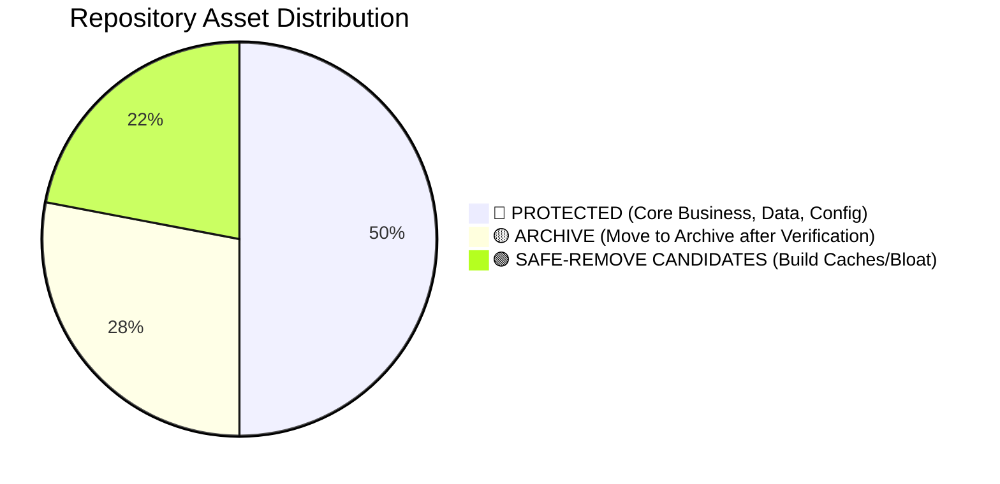
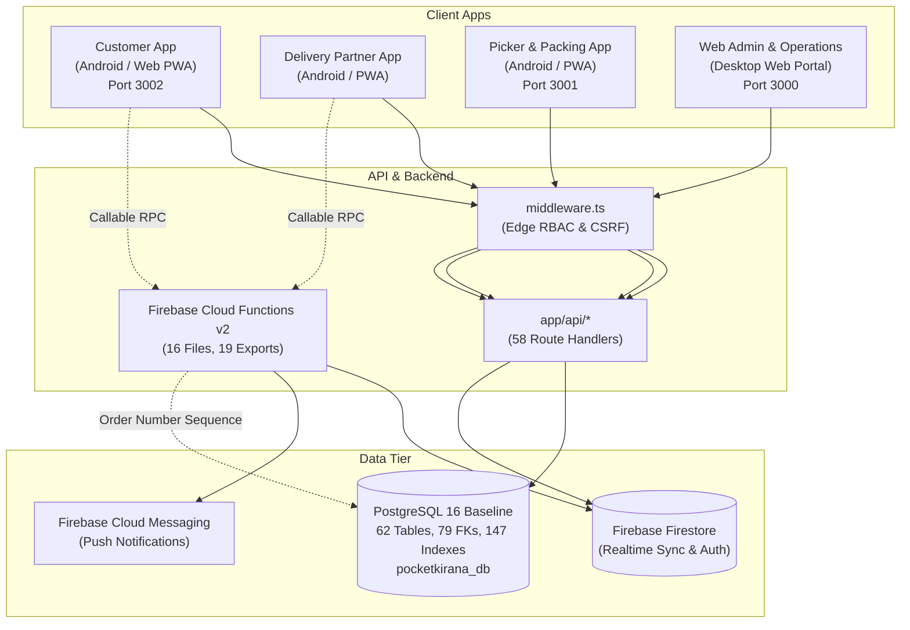
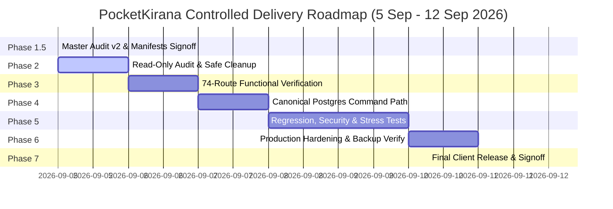

# PocketKirana — Project Master Audit & Single Source of Truth
**Version:** 2.0.0-STRICT (Phase 1.5 — Audit Correction & Dependency Freeze)  
**Target Client Delivery:** 12 September 2026  
**Document Status:** MASTER INVENTORY & SYSTEM BLUEPRINT  
**Governance Policy:** STRICTLY READ-ONLY AUDIT. Zero destructive database modifications, schema drops, or file removals until explicit Phase 2 signoff.

---

## Executive Summary & Governance Model

PocketKirana has evolved through rapid feature engineering into a multi-application enterprise grocery platform. To transition from speculative readiness to verified production delivery, this Master Audit establishes the **Three Truths Framework**:

```text
                    POCKETKIRANA
                         │
                 MASTER AUDIT v2
                         │
        ┌────────────────┼────────────────┐
        ▼                ▼                ▼
   FILE TRUTH       CODE TRUTH       DATA TRUTH
        │                │                │
   What exists      What works       What exists
   (Repository)     (Runtime/APIs)   (Live DB: 62)
        │                │                │
        └────────────────┼────────────────┘
                         ▼
                 BUSINESS FLOW TRUTH
                   (End-to-End SLA)
                         │
                         ▼
                  RELEASE TRUTH
               (12 September Gate)
```

### Absolute Governance Decisions (Phase 1.5)
1. **Phase 2 Gate is Strictly CLOSED:** No file removals, no file moves, and zero database schema changes are permitted at this stage.
2. **PostgreSQL Live Baseline:** Verified at **62 live tables, 79 foreign keys, 147 indexes, 25 populated tables, 37 empty tables, and 3 sequences**. Database cleanup candidates: **NONE CONFIRMED**. Empty tables represent unmigrated or upcoming business capabilities; empty is NOT deletion evidence.
3. **Database Retention Rule:** No database tables will be removed during Phase 2 cleanup. Phase 2 is strictly limited to verified non-database build caches, duplicate documents, and design mockups.
4. **Command Path Blocker:** The primary operational blocker is the dual-persistence boundary (PostgreSQL vs Firestore legacy collections) and the missing Outbox Projection Worker.
5. **Rigorous Verification Classification:** Replaced speculative "READY" labels with strict verification tiers (🟢 PRODUCTION VERIFIED, 🟡 IMPLEMENTED / VERIFICATION PENDING, 🔴 BLOCKED / BROKEN, ⚪ STATIC / INFORMATIONAL).

---

## Table of Contents
1. [Complete Repository Inventory](#1-complete-repository-inventory)
2. [Folder Structure & Target Organisation](#2-folder-structure--target-organisation)
3. [File Classification Tiers](#3-file-classification-tiers)
4. [Duplicate & Obsolete Candidates](#4-duplicate--obsolete-candidates)
5. [Application List & Architecture Overview](#5-application-list--architecture-overview)
6. [Every Page & Route Inventory (74 Routes)](#6-every-page--route-inventory-74-routes)
7. [Page Completion Status Matrix (74 Routes Inventoried; Verification Pending)](#7-page-completion-status-matrix)
8. [API Inventory (58 Routes)](#8-api-inventory-58-routes)
9. [Backend Cloud Function Inventory (16 Files, 19 Exports)](#9-backend-cloud-function-inventory)
10. [Database Mapping (PostgreSQL 62-Table Live Baseline)](#10-database-mapping-postgresql-62-table-live-baseline)
11. [Firebase Mapping (Auth, Firestore, Storage, FCM)](#11-firebase-mapping-auth-firestore-storage-fcm)
12. [Authentication Flow & RBAC](#12-authentication-flow--rbac)
13. [Order Lifecycle Flow](#13-order-lifecycle-flow)
14. [Inventory & FEFO Reservation Flow](#14-inventory--fefo-reservation-flow)
15. [Payment & Reconciliation Flow](#15-payment--reconciliation-flow)
16. [Delivery & Dispatch Flow](#16-delivery--dispatch-flow)
17. [Notification Engine Flow](#17-notification-engine-flow)
18. [Test Suite Inventory (14 Suites + Payment Runner)](#18-test-suite-inventory)
19. [Security Posture & RBAC Matrix](#19-security-posture--rbac-matrix)
20. [Performance & Concurrency Status](#20-performance--concurrency-status)
21. [Deployment & Infrastructure Status](#21-deployment--infrastructure-status)
22. [Master Ranked Architectural Blockers](#22-master-ranked-architectural-blockers)
23. [Safe-to-Remove Candidates (Phase 2 Preview)](#23-safe-to-remove-candidates-phase-2-preview)
24. [Archive Candidates (Phase 2 Preview)](#24-archive-candidates-phase-2-preview)
25. [Protected Core Assets (Must Never Be Deleted)](#25-protected-core-assets-must-never-be-deleted)
26. [Missing Implementation & Technical Debt](#26-missing-implementation--technical-debt)
27. [Final Release Checklist](#27-final-release-checklist)
28. [12 September Controlled Delivery Roadmap](#28-12-september-controlled-delivery-roadmap)

---

## 1. Complete Repository Inventory

The repository root at `d:\pocketkirana` contains **44 root files** and **19 top-level subdirectories**:

### 1.1 Root Top-Level Directories
| Directory | Nature | Files / Subdirs | Primary Function |
| :--- | :--- | :--- | :--- |
| `app/` | Source Code | 43 routes, 58 APIs | Root Next.js Web App, Web Admin, Customer Web, Darkstore Ops, and `/api/*` handlers |
| `customer-app/` | Source Code | 15 routes + Android | Dedicated Customer App (Next.js App Router + Capacitor Android project) |
| `delivery-app/` | Source Code | 6 routes + Android | Dedicated Delivery Partner App (Next.js App Router + Capacitor Android project) |
| `picker-app/` | Source Code | 10 routes + Android | Dedicated Picker & Packing Warehouse App (Next.js App Router + Capacitor Android) |
| `components/` | Source Code | 7 subdirectories | Shared and role-specific UI components (Admin, Customer, Partner, Picker, Common, Layout, UI) |
| `functions/` | Backend Code | 16 source files | Firebase Cloud Functions v2 (`asia-south1`) |
| `lib/` | Shared Library | 35 TypeScript files | Business engines (Postgres pool, Zustand store, FEFO, pricing, routing, FCM, auth) |
| `services/` | Shared Library | 1 file (`services/api/index.ts`) | Frontend API abstraction layer |
| `types/` | Types | 1 file (`types/index.ts`, 805 lines) | Authoritative TypeScript interfaces, schemas, and enums |
| `scripts/` | Tooling & Tests | 34 JavaScript files | Database migration, operational verification, E2E tests, load benchmarks |
| `public/` | Static Assets | Media & icons | Public web assets, logos, default placeholders |
| `release-apks/` | Release Binaries | 3 `.apk` files | Release binaries for Customer (5.79MB), Delivery (5.32MB), Picker (4.78MB) — **PROTECTED** |
| `backups/` | Storage | Empty (0 files) | Target destination for `backup_database.js` dumps |
| `scratch/` | Ad-hoc Tests | 2 TypeScript files | `test-lifecycle-e2e.ts`, `test-realtime-lifecycle.ts` |
| `stitch_downloads/` | Design Prototypes | 18 HTML/PNG files | Scraped Stitch UI mockups and static HTML prototypes |
| `stitch_pocketkirana_grocery_platform/` | Design Prototypes | 17 subdirectories | Static UI screen mockups from design phase |
| `.next/` | Generated Cache | Build cache | Next.js build cache and server bundles for root app |
| `node_modules/` | Dependencies | Node packages | Root project runtime and build dependencies |
| `.vscode/` | Configuration | IDE settings | Antigravity / VS Code workspace configurations |

### 1.2 Root Top-Level Files
- **Configuration & Build:** `package.json`, `package-lock.json`, `next.config.ts`, `next-env.d.ts`, `tsconfig.json`, `tsconfig.tsbuildinfo`, `tailwind.config.ts`, `postcss.config.mjs`, `ecosystem.config.js`, `middleware.ts`.
- **Firebase Configuration:** `firebase.json`, `.firebaserc`, `firestore.rules`, `firestore.indexes.json`, `storage.rules`.
- **Environment:** `.env.local` (active secrets/credentials), `.env.example`.
- **Ad-hoc Utilities:** `runPhonePeTests.js`, `download_stitch.ps1`.
- **Documentation (24 Markdown files):**
  - Architecture & Design: `CANONICAL_COMMAND_PATH_DESIGN.md`, `READER_WRITER_OWNERSHIP_MATRIX.md`, `DataBase.md`, `FILE_CLASSIFICATION.md`, `TDR File Website Build (1).md`, `UI UX Design Brief (1).md`.
  - Operations & Runbooks: `OPERATIONS_RUNBOOK.md`, `INCIDENT_MANAGEMENT.md`, `BACKUP_RECOVERY.md`, `INVENTORY_RECONCILIATION.md`, `PAYMENT_RECONCILIATION.md`, `PILOT_INCIDENT_LOG.md`.
  - Migration & Cutover: `CUTOVER_GAP_MATRIX.md`, `CUTOVER_GAP_VERIFICATION.md`, `BUSINESS_RULE_APPROVAL_MATRIX.md`.
  - Product & Strategy: `PRD Brief (1).md`, `App Flow Brief (1).md`, `Implementation Plan (1).md`, `NEXT_ROADMAP.md`, `PROJECT_STATUS.md`, `PRODUCTION_CHECKLIST.md`, `PHONEPE_INTEGRATION.md`, `Test File.md`, `KNOWN_ISSUES.md`.

---

## 2. Folder Structure & Target Organisation

To prevent structural confusion without breaking active build paths or runtime imports, the repository follows this strict logical model:

```text
POCKETKIRANA
│
├── 01-PRODUCTION-APPS
│   ├── web-admin-and-portal    → Root app/ (port 3000)
│   ├── customer-app            → customer-app/ (port 3002 / Android)
│   ├── delivery-app            → delivery-app/ (Android / PWA)
│   └── picker-app              → picker-app/ (port 3001 / Android)
│
├── 02-BACKEND
│   ├── functions               → functions/ (Cloud Functions v2)
│   ├── api                     → app/api/ (58 Next.js route handlers)
│   ├── services                → services/ & lib/ (Business domain logic)
│   └── types                   → types/index.ts (Authoritative schema definitions)
│
├── 03-DATABASE
│   ├── live-baseline           → 62 live tables on pocketkirana_db (Zero deletion)
│   ├── schema                  → scripts/init_client_postgres_tables.js
│   ├── migrations              → scripts/migrate_*.js, scripts/create_order_sequence.js
│   ├── seeds                   → scripts/init_*.js, scripts/sync_*.js
│   └── reconciliation          → lib/reconciliationService.ts, scripts/verify_*.js
│
├── 04-CONFIGURATION
│   ├── environment             → .env.local, .env.example
│   ├── firebase                → firebase.json, firestore.rules, storage.rules
│   ├── process-manager         → ecosystem.config.js (PM2)
│   └── edge-security           → middleware.ts
│
├── 05-TESTS
│   ├── unit-and-domain         → scripts/test_pricing_engine.js, scripts/test_expiry_clearance.js
│   ├── integration             → scripts/e2e_order_to_delivery_test.js, runPhonePeTests.js
│   ├── load-and-concurrency    → scripts/performance_load_test.js, phase_20_production_hardening_test.js
│   └── security-audit          → scripts/security_audit_test.js
│
├── 06-SCRIPTS
│   ├── operations              → scripts/backup_database.js, scripts/check_*.js
│   └── diagnostics             → scripts/test_client_postgres.js, scripts/test_p2p_connection.js
│
├── 07-DOCUMENTATION
│   ├── canonical-architecture  → CANONICAL_COMMAND_PATH_DESIGN.md, POCKETKIRANA_PROJECT_MASTER_AUDIT.md
│   ├── operations-runbooks     → OPERATIONS_RUNBOOK.md, BACKUP_RECOVERY.md, INCIDENT_MANAGEMENT.md
│   └── business-matrix         → BUSINESS_RULE_APPROVAL_MATRIX.md, READER_WRITER_OWNERSHIP_MATRIX.md
│
├── 08-ARCHIVE (Phase 2 Move — After Comparison & Approval)
│   ├── design-prototypes       → stitch_downloads/, stitch_pocketkirana_grocery_platform/
│   ├── duplicate-briefs        → *(1).md files (verified duplicates only)
│   └── scratch-tests           → scratch/
│
└── 09-RELEASE (PROTECTED)
    ├── binaries                → release-apks/ (Customer, Delivery, Picker APKs)
    └── checklist               → PRODUCTION_CHECKLIST.md, release gates
```

---

## 3. File Classification Tiers



1. **🔴 PROTECTED (Core Business, Data, Security, Configuration):**
   - Must NEVER be removed, renamed, or modified without dedicated approval and automated test verification.
   - Includes: `.env.local`, `lib/postgres.ts`, `lib/store.ts`, `lib/pricingEngine.ts`, `lib/fefo.ts`, `middleware.ts`, `types/index.ts`, `scripts/init_client_postgres_tables.js`, `scripts/cleanup_legacy_user_table.js`, `ecosystem.config.js`, all active `/api/*` routes, core application pages, all 34 scripts in `scripts/`, and all release binaries in `release-apks/`.
2. **🟡 ARCHIVE CANDIDATES (Reference, Historical Evidence, Design Prototypes):**
   - Non-executable reference materials and design mockups.
   - *Requirement:* Content comparison must be completed before any file is moved to `_archive/`.
   - Includes: `stitch_downloads/`, `stitch_pocketkirana_grocery_platform/`, `download_stitch.ps1`, verified duplicate `*(1).md` specs, `scratch/*`.
3. **🟢 SAFE-TO-REMOVE CANDIDATES (Build Artifacts & Generated Caches):**
   - Reproducible build outputs and leaked Gradle wrapper caches.
   - *Requirement:* Verification protocol (Check .gitignore → Check Git tracking → Check build reproducibility) before any deletion.
   - Includes: `customer-app/android/.gradle/`, `customer-app/android/8.14.3/`, `customer-app/android/9.1.0/`, `customer-app/android/build/`, `customer-app/android/buildOutputCleanup/`, `customer-app/android/vcs-1/`, `customer-app/android/file-system.probe`, `.next/`, `customer-app/.next/`, `customer-app/out/`, `delivery-app/.next/`, `delivery-app/out/`, `picker-app/.next/`, `picker-app/out/`.

---

## 4. Duplicate & Obsolete Candidates

| Candidate File / Folder | Current Location | Nature | Verification Protocol Before Action |
| :--- | :--- | :--- | :--- |
| `App Flow Brief (1).md` | Root | Specification | Compare against canonical app flow spec; verify no unique delta before archive. |
| `Implementation Plan (1).md` | Root | Historical Plan | Compare against active roadmap; archive once superseded status confirmed. |
| `PRD Brief (1).md` | Root | Specification | Compare against master PRD; archive duplicate. |
| `TDR File Website Build (1).md` | Root | Specification | Compare against technical design records; archive duplicate. |
| `UI UX Design Brief (1).md` | Root | Specification | Compare against UI design system; archive duplicate. |
| `stitch_downloads/` | Root | 18 static files | Static HTML/PNG screens from initial prototyping. Safe to archive. |
| `stitch_pocketkirana_grocery_platform/` | Root | 17 subdirs | Raw Stitch UI export directories. Safe to archive. |
| `download_stitch.ps1` | Root | Utility Script | One-time scraper script. Safe to archive. |
| `scratch/test-lifecycle-e2e.ts` | `scratch/` | Ad-hoc Script | Superseded by `scripts/e2e_order_to_delivery_test.js`. Safe to archive. |
| `scratch/test-realtime-lifecycle.ts` | `scratch/` | Ad-hoc Script | Temporary verification script. Safe to archive. |
| `components/partner/NewRequestModal.tsx` | `components/` | Unused UI | Repository grep confirms 0 imports across codebase. Safe to archive. |
| `customer-app/android/8.14.3/` | `customer-app/` | Gradle Leak | Leaked Gradle wrapper cache in project root. Safe to remove after verify. |
| `customer-app/android/9.1.0/` | `customer-app/` | Gradle Leak | Leaked Gradle wrapper cache in project root. Safe to remove after verify. |
| `customer-app/android/buildOutputCleanup/` | `customer-app/` | Gradle Cache | Build cleanup metadata. Safe to remove after verify. |
| `customer-app/android/vcs-1/` | `customer-app/` | VCS Probe | Gradle VCS cache. Safe to remove after verify. |
| `customer-app/android/file-system.probe` | `customer-app/` | Gradle Probe | Zero-byte probe file. Safe to remove after verify. |

---

## 5. Application List & Architecture Overview

PocketKirana operates four distinct runtime applications:



1. **Web Admin & Operations Management Portal (`app/`):**
   - Framework: Next.js 15 (App Router), Tailwind CSS, Zustand.
   - Responsibilities: Store configuration, darkstore operations, dynamic catalog & brand management, live dispatch control room, rider fleet monitoring, sales analytics, customer support.
   - Runtime: Port 3000 (Clustered PM2 instance).
2. **Customer Mobile Application (`customer-app/`):**
   - Framework: Next.js 15 + Capacitor 8 (`@capacitor/android`).
   - Responsibilities: End-customer ordering, geolocation search, catalog browsing, real-time cart pricing, address selection, PhonePe payment, order tracking.
   - Runtime: Port 3002 (Local dev) / Standalone APK (`release-apks/PocketKirana-Customer.apk`).
3. **Delivery Partner Mobile Application (`delivery-app/`):**
   - Framework: Next.js 15 + Capacitor 8.
   - Responsibilities: Rider dispatch reception, GPS background pinging, store pickup verification, turn-by-turn customer routing, delivery confirmation OTP, daily earnings ledger.
   - Runtime: Standalone APK (`release-apks/PocketKirana-DeliveryPartner.apk`).
4. **Warehouse Picker & Packing Application (`picker-app/`):**
   - Framework: Next.js 15 + Capacitor 8.
   - Responsibilities: Darkstore picker workstation. SLA-sorted order picking queue, barcode scanning validation, item substitution, FEFO batch selection, packing completion, handoff stage.
   - Runtime: Port 3001 (PM2 fork) / Standalone APK (`release-apks/PocketKirana-Picker.apk`).

---

## 6. Every Page & Route Inventory (74 Routes)

Across all four applications, PocketKirana defines **74 distinct page routes**:

### 6.1 Root Web & Admin Portal (`app/`) — 43 Routes
1. `/` (`app/page.tsx`)
2. `/access-denied` (`app/access-denied/page.tsx`)
3. `/admin` (`app/admin/page.tsx`)
4. `/admin/delivery-fleet` (`app/admin/delivery-fleet/page.tsx`)
5. `/admin/orders` (`app/admin/orders/page.tsx`)
6. `/admin/products` (`app/admin/products/page.tsx`)
7. `/admin/service-area` (`app/admin/service-area/page.tsx`)
8. `/admin/stores` (`app/admin/stores/page.tsx`)
9. `/brand/[slug]` (`app/brand/[slug]/page.tsx`)
10. `/brands` (`app/brands/page.tsx`)
11. `/cancellation-policy` (`app/cancellation-policy/page.tsx`)
12. `/categories` (`app/categories/page.tsx`)
13. `/category/[slug]` (`app/category/[slug]/page.tsx`)
14. `/category/[slug]/[subSlug]` (`app/category/[slug]/[subSlug]/page.tsx`)
15. `/checkout` (`app/checkout/page.tsx`)
16. `/checkout/mock-phonepe` (`app/checkout/mock-phonepe/page.tsx`)
17. `/checkout/success` (`app/checkout/success/page.tsx`)
18. `/contact` (`app/contact/page.tsx`)
19. `/delivery` (`app/delivery/page.tsx`)
20. `/express` (`app/express/page.tsx`)
21. `/faq` (`app/faq/page.tsx`)
22. `/offers` (`app/offers/page.tsx`)
23. `/orders` (`app/orders/page.tsx`)
24. `/orders/[id]` (`app/orders/[id]/page.tsx`)
25. `/orders/[id]/track` (`app/orders/[id]/track/page.tsx`)
26. `/partner` (`app/partner/page.tsx`)
27. `/partner/active` (`app/partner/active/page.tsx`)
28. `/partner/earnings` (`app/partner/earnings/page.tsx`)
29. `/picker` (`app/picker/page.tsx`)
30. `/privacy` (`app/privacy/page.tsx`)
31. `/product/[slug]` (`app/product/[slug]/page.tsx`)
32. `/products` (`app/products/page.tsx`)
33. `/profile` (`app/profile/page.tsx`)
34. `/recipes` (`app/recipes/page.tsx`)
35. `/recipes/[slug]` (`app/recipes/[slug]/page.tsx`)
36. `/refund-policy` (`app/refund-policy/page.tsx`)
37. `/saved-addresses` (`app/saved-addresses/page.tsx`)
38. `/search` (`app/search/page.tsx`)
39. `/security` (`app/security/page.tsx`)
40. `/seller` (`app/seller/page.tsx`)
41. `/store` (`app/store/page.tsx`)
42. `/terms` (`app/terms/page.tsx`)
43. `/wishlist` (`app/wishlist/page.tsx`)

### 6.2 Customer Mobile Application (`customer-app/app/`) — 15 Routes
44. `/` (`customer-app/app/page.tsx`)
45. `/home` (`customer-app/app/home/page.tsx`)
46. `/about` (`customer-app/app/about/page.tsx`)
47. `/cart` (`customer-app/app/cart/page.tsx`)
48. `/categories` (`customer-app/app/categories/page.tsx`)
49. `/category/[slug]` (`customer-app/app/category/[slug]/page.tsx`)
50. `/checkout` (`customer-app/app/checkout/page.tsx`)
51. `/login` (`customer-app/app/login/page.tsx`)
52. `/orders` (`customer-app/app/orders/page.tsx`)
53. `/orders/[id]` (`customer-app/app/orders/[id]/page.tsx`)
54. `/privacy` (`customer-app/app/privacy/page.tsx`)
55. `/product/[id]` (`customer-app/app/product/[id]/page.tsx`)
56. `/profile` (`customer-app/app/profile/page.tsx`)
57. `/saved-addresses` (`customer-app/app/saved-addresses/page.tsx`)
58. `/search` (`customer-app/app/search/page.tsx`)

### 6.3 Delivery Partner Application (`delivery-app/app/`) — 6 Routes
59. `/` (`delivery-app/app/page.tsx`)
60. `/home` (`delivery-app/app/home/page.tsx`)
61. `/active` (`delivery-app/app/active/page.tsx`)
62. `/history` (`delivery-app/app/history/page.tsx`)
63. `/login` (`delivery-app/app/login/page.tsx`)
64. `/profile` (`delivery-app/app/profile/page.tsx`)

### 6.4 Warehouse Picker Application (`picker-app/app/`) — 10 Routes
65. `/` (`picker-app/app/page.tsx`)
66. `/home` (`picker-app/app/home/page.tsx`)
67. `/login` (`picker-app/app/login/page.tsx`)
68. `/tasks` (`picker-app/app/tasks/page.tsx`)
69. `/picking/[id]` (`picker-app/app/picking/[id]/page.tsx`)
70. `/packing/[id]` (`picker-app/app/packing/[id]/page.tsx`)
71. `/handoff/[id]` (`picker-app/app/handoff/[id]/page.tsx`)
72. `/putaway` (`picker-app/app/putaway/page.tsx`)
73. `/scan` (`picker-app/app/scan/page.tsx`)
74. `/profile` (`picker-app/app/profile/page.tsx`)

---

## 7. Page Completion Status Matrix

> [!IMPORTANT]
> **Governance Notice:** 74 pages/routes are inventoried. **74-page functional verification is PENDING** full Phase 3 end-to-end execution.  
> Statuses below reflect strict classification criteria:
> - 🟢 **PRODUCTION VERIFIED:** Real business flow successfully demonstrated end-to-end.
> - 🟡 **IMPLEMENTED / VERIFICATION PENDING:** Code, UI, and API connections exist, but complete real-world flow verification is pending.
> - 🔴 **BLOCKED / BROKEN:** Known technical or business failure.
> - ⚪ **STATIC / INFORMATIONAL:** Informational screen requiring no transactional backend.

### 7.1 Customer Application (`customer-app`)
| Page Route | Code Exists | UI | API | DB | Real Flow | Status | Governance Notes |
| :--- | :---: | :---: | :---: | :---: | :---: | :---: | :--- |
| `/home` | Yes | 🟢 | 🟢 | 🟢 | 🟡 | 🟡 VERIFICATION PENDING | Catalog streaming operational; verification pending |
| `/login` | Yes | 🟢 | 🟢 | 🟢 | 🟡 | 🟡 VERIFICATION PENDING | Firebase Phone Auth wired; live SMS gateway pending |
| `/categories` | Yes | 🟢 | 🟢 | 🟢 | 🟡 | 🟡 VERIFICATION PENDING | Subcategory tree rendering operational |
| `/category/[slug]` | Yes | 🟢 | 🟢 | 🟢 | 🟡 | 🟡 VERIFICATION PENDING | Filter & sort logic operational |
| `/product/[id]` | Yes | 🟢 | 🟢 | 🟢 | 🟡 | 🟡 VERIFICATION PENDING | Variant selector & stock display operational |
| `/search` | Yes | 🟢 | 🟢 | 🟢 | 🟡 | 🟡 VERIFICATION PENDING | Instant search query handler operational |
| `/cart` | Yes | 🟢 | 🟢 | 🟢 | 🟡 | 🟡 VERIFICATION PENDING | Pricing engine integrated |
| `/checkout` | Yes | 🟢 | 🟢 | 🔴 | 🔴 | 🔴 BLOCKED | Writes to Firestore; PostgreSQL command cutover pending |
| `/saved-addresses` | Yes | 🟢 | 🟢 | 🟢 | 🟡 | 🟡 VERIFICATION PENDING | Geotagging & coordinates validation operational |
| `/orders` | Yes | 🟢 | 🟢 | 🟢 | 🟡 | 🟡 VERIFICATION PENDING | Firestore user orders query operational |
| `/orders/[id]` | Yes | 🟢 | 🟢 | 🟢 | 🟡 | 🟡 VERIFICATION PENDING | Live timeline & rider map rendering operational |
| `/about` | Yes | 🟢 | — | — | 🟢 | ⚪ STATIC / INFO | Static informational screen |
| `/privacy` | Yes | 🟢 | — | — | 🟢 | ⚪ STATIC / INFO | Static legal policy screen |
| `/profile` | Yes | 🟢 | 🟢 | 🟢 | 🟡 | 🟡 VERIFICATION PENDING | User account details operational |

### 7.2 Delivery Partner Application (`delivery-app`)
| Page Route | Code Exists | UI | API | DB | Real Flow | Status | Governance Notes |
| :--- | :---: | :---: | :---: | :---: | :---: | :---: | :--- |
| `/login` | Yes | 🟢 | 🟢 | 🟢 | 🟡 | 🟡 VERIFICATION PENDING | Role check on phone login operational |
| `/home` | Yes | 🟢 | 🟢 | 🟢 | 🟡 | 🟡 VERIFICATION PENDING | Duty status toggle & order alert feed operational |
| `/active` | Yes | 🟢 | 🟢 | 🟢 | 🟡 | 🟡 VERIFICATION PENDING | Stepper & OTP flow wired |
| `/history` | Yes | 🟢 | 🟢 | 🟢 | 🟡 | 🟡 VERIFICATION PENDING | Reads past delivery assignments operational |
| `/profile` | Yes | 🟢 | 🟢 | 🟢 | 🟡 | 🟡 VERIFICATION PENDING | Rider badge & vehicle details operational |

### 7.3 Warehouse Picker Application (`picker-app`)
| Page Route | Code Exists | UI | API | DB | Real Flow | Status | Governance Notes |
| :--- | :---: | :---: | :---: | :---: | :---: | :---: | :--- |
| `/login` | Yes | 🟢 | 🟢 | 🟢 | 🟡 | 🟡 VERIFICATION PENDING | Staff PIN validation operational |
| `/home` | Yes | 🟢 | 🟢 | 🟢 | 🟡 | 🟡 VERIFICATION PENDING | Picking throughput gauge operational |
| `/tasks` | Yes | 🟢 | 🟢 | 🟢 | 🟡 | 🟡 VERIFICATION PENDING | SLA priority queue query operational |
| `/picking/[id]` | Yes | 🟢 | 🟢 | 🟢 | 🟡 | 🟡 VERIFICATION PENDING | Barcode scan verification operational |
| `/packing/[id]` | Yes | 🟢 | 🟢 | 🟢 | 🟡 | 🟡 VERIFICATION PENDING | Tote box packing & sealing operational |
| `/handoff/[id]` | Yes | 🟢 | 🟢 | 🟢 | 🟡 | 🟡 VERIFICATION PENDING | Rider handoff OTP handshake operational |
| `/putaway` | Yes | 🟢 | 🟢 | 🟢 | 🟡 | 🟡 VERIFICATION PENDING | Inwarding bin allocation operational |
| `/scan` | Yes | 🟢 | 🟢 | 🟢 | 🟡 | 🟡 VERIFICATION PENDING | Universal barcode lookup operational |
| `/profile` | Yes | 🟢 | 🟢 | 🟢 | 🟡 | 🟡 VERIFICATION PENDING | Staff shift log operational |

### 7.4 Web Admin & Operations Portal (`app/`)
| Page Route | Code Exists | UI | API | DB | Real Flow | Status | Governance Notes |
| :--- | :---: | :---: | :---: | :---: | :---: | :---: | :--- |
| `/admin` | Yes | 🟢 | 🟢 | 🟢 | 🟡 | 🟡 VERIFICATION PENDING | GMV & sales analytics charts operational |
| `/admin/orders` | Yes | 🟢 | 🟢 | 🟢 | 🟡 | 🟡 VERIFICATION PENDING | Live order control room operational |
| `/admin/products` | Yes | 🟢 | 🟢 | 🟢 | 🟡 | 🟡 VERIFICATION PENDING | Product 360 modal & variant editor operational |
| `/admin/delivery-fleet` | Yes | 🟢 | 🟢 | 🟢 | 🟡 | 🟡 VERIFICATION PENDING | Realtime GPS fleet map operational |
| `/admin/service-area` | Yes | 🟢 | 🟢 | 🟢 | 🟡 | 🟡 VERIFICATION PENDING | Darkstore geofence editor operational |
| `/admin/stores` | Yes | 🟢 | 🟢 | 🟢 | 🟡 | 🟡 VERIFICATION PENDING | Store configuration management operational |
| `/store` | Yes | 🟢 | 🟢 | 🟢 | 🟡 | 🟡 VERIFICATION PENDING | Stock inwarding & batch expiry operational |
| `/offers` | Yes | 🟢 | 🟢 | 🟢 | 🟡 | 🟡 VERIFICATION PENDING | Promotion & coupon manager operational |

---

## 8. API Inventory (58 Routes)

PocketKirana defines **58 Next.js API route handlers** under `app/api/`:

### 8.1 Admin & Operations APIs (7 Endpoints)
1. `GET /api/admin/analytics` — GMV, order volume, customer cohort analytics
2. `GET /api/admin/analytics/overview` — Executive operational KPI snapshot
3. `POST /api/admin/dispatch` — Manual order reassignment & rider dispatch override
4. `GET /api/admin/reports/sales` — Daily/Weekly sales summary generator
5. `POST /api/admin/store/operations` — Emergency pause, surge demand & operating hours toggle
6. `GET, POST /api/admin/stores` — Store list & darkstore creation
7. `GET, PATCH /api/admin/stores/[id]` — Individual store configuration & status

### 8.2 Authentication & Session APIs (5 Endpoints)
8. `POST /api/auth/send-otp` — Phone OTP generation (Firebase Auth integration)
9. `POST /api/auth/verify-otp` — OTP validation & custom session cookie issuance
10. `GET /api/auth/me` — Current authenticated user identity, role, and permissions
11. `POST /api/auth/logout` — Revoke active session cookie
12. `POST /api/auth/logout-all` — Global token revocation across all user devices

### 8.3 Catalog, Brands & Categories APIs (7 Endpoints)
13. `GET, POST /api/brands` — List active brands / Create new brand with logo BYTEA
14. `POST /api/brands/reorder` — Update brand display order on storefront
15. `GET, PATCH, DELETE /api/brands/[id]` — Brand details, updates, and soft-delete
16. `GET, POST /api/categories` — Multi-tier category tree with subcategory & product counts
17. `POST /api/categories/move` — Reparent category in dynamic hierarchy
18. `POST /api/categories/reorder` — Update storefront category sorting
19. `GET, PATCH, DELETE /api/categories/[id]` — Category CRUD operations

### 8.4 Products, Variants & Identifiers APIs (7 Endpoints)
20. `GET, POST /api/products` — Catalog search with facet filtering & pagination
21. `GET /api/products/barcode/[value]` — Fast O(1) barcode lookup (EAN-13, UPC, internal SKU)
22. `POST /api/products/identifiers/verify` — Duplicate barcode conflict detector
23. `GET, POST /api/products/[id]/identifiers` — Manage multiple barcodes per product SKU
24. `GET, POST /api/products/[id]/variants` — Weight & pack size variants for a product
25. `POST /api/products/[id]/variants/reorder` — Reorder variant presentation order
26. `GET, PATCH, DELETE /api/products/[id]/variants/[variantId]` — Variant price, MRP, and SKU editor

### 8.5 Cart, Pricing & Checkout APIs (4 Endpoints)
27. `POST /api/cart/validate` — Validate line items, stock availability, and per-user limits
28. `POST /api/checkout/calculate-price` — Authoritative price calculation with coupon validation
29. `POST /api/checkout/quote` — Generate frozen 15-minute price quote token
30. `POST /api/checkout/validate` — Pre-checkout address serviceability and minimum order validation

### 8.6 Payment & Gateway APIs (5 Endpoints)
31. `POST /api/payments/create-order` — Payment intent initiation
32. `POST /api/payments/phonepe/create` — PhonePe v1 payload creation and SHA-256 signing
33. `POST /api/payments/phonepe/verify` — Client-side redirect payment status query
34. `POST /api/payments/phonepe/webhook` — Authoritative PhonePe Server-to-Server IPN webhook
35. `POST /api/payments/verify` — Generic payment signature verification

### 8.7 Orders & Fulfilment APIs (2 Endpoints)
36. `GET /api/orders/[id]` — Detailed order record, status history, and item breakdown
37. `PATCH /api/orders/[id]/status` — State machine compliant order status progression

### 8.8 Inventory, Batches & FEFO APIs (5 Endpoints)
38. `POST /api/inventory/adjust` — Manual darkstore stock adjustment with audit reason
39. `GET, POST /api/inventory/batches` — Batch creation with manufacture date, expiry, and purchase cost
40. `GET /api/inventory/events` — Append-only inventory transaction ledger
41. `GET /api/inventory/expiry` — Expiry scoring report (Normal, Watch, Warning, Clearance, Expired)
42. `POST /api/inventory/expiry/clearance` — Apply automated clearance sale discounts

### 8.9 Warehouse Picking & Packing APIs (4 Endpoints)
43. `POST /api/picking/tasks/[id]/accept` — Picker claims picking task
44. `POST /api/picking/tasks/[id]/items/[itemId]/pick` — Confirm item barcode scan & batch allocation
45. `POST /api/picking/tasks/[id]/complete` — Finalize picking and route to packing
46. `POST /api/packing/tasks/[id]/complete` — Complete box packaging, seal barcode, and transfer to dispatch

### 8.10 Delivery Fleet & Geolocation APIs (5 Endpoints)
47. `POST /api/delivery/assignments/[id]/accept` — Rider accepts dispatch assignment
48. `POST /api/delivery/assignments/[id]/pickup` — Confirm store pickup via QR / OTP
49. `POST /api/delivery/assignments/[id]/deliver` — Complete final customer delivery
50. `POST /api/delivery/location` — Background GPS coordinate telemetry ping
51. `POST /api/delivery/orders/[id]/verify-otp` — Customer delivery verification OTP check

### 8.11 Location & Geocoding APIs (4 Endpoints)
52. `GET /api/location/search` — Autocomplete street and locality search
53. `GET /api/location/reverse-geocode` — Lat/Long to human-readable address resolution
54. `GET /api/location/serviceability` — Polygon & Haversine distance serviceability check
55. `GET, POST /api/location/saved` — User saved address management

### 8.12 Auxiliary & Maintenance APIs (3 Endpoints)
56. `GET /api/health` — Platform healthcheck (Postgres pool, Firestore, node uptime)
57. `POST /api/seed` — Development database seeding utility
58. `GET, POST /api/service-requests` — Customer support tickets and resolution workflow

---

## 9. Backend Cloud Function Inventory

```text
Function source files:        16 files (14 implementation + index.ts + utils.ts)
Declared/exported functions:  19 named functions
Successfully compiled:         0 (Blocked by TS2307 in placeOrder.ts)
Deployed functions:           Pending live Firebase deployment audit
```

### 9.1 Detailed Exported Function Manifest
| Declared Function Name | Source Implementation File | Trigger Type | Functional Responsibility | Compilation Status |
| :--- | :--- | :--- | :--- | :--- |
| `validateDeliveryZone` | `inventory/validateDeliveryZone.ts` | HTTPS Callable | Haversine distance verification against store geofence. | Blocked by package build |
| `scanBarcode` | `inventory/scanBarcode.ts` | HTTPS Callable | Resolves scanned barcode against product SKUs. | Blocked by package build |
| `confirmPutaway` | `inventory/putaway.ts` | HTTPS Callable | Confirms warehouse stock inwarding into bin. | Blocked by package build |
| `releaseExpiredReservations` | `inventory/releaseExpiredReservations.ts` | Scheduled Cron | Sweeps abandoned checkouts (>15 min) and releases stock hold. | Blocked by package build |
| `placeOrder` | `orders/placeOrder.ts` | HTTPS Callable | Server-side cart validation, address check, price math, and order creation. | 🔴 **TS2307 ERROR** (Cannot find `../../lib/postgres`) |
| `cancelOrder` | `orders/cancelOrder.ts` | HTTPS Callable | Order cancellation with stock restoration and refund trigger. | Blocked by package build |
| `autoCompleteOrders` | `orders/autoCompleteOrders.ts` | Scheduled Cron | Auto-completes delivered orders after 24h idle period. | Blocked by package build |
| `acceptDeliveryAssignment` | `delivery/acceptAssignment.ts` | HTTPS Callable | Rider claims pending dispatch assignment. | Blocked by package build |
| `rejectDeliveryAssignment` | `delivery/acceptAssignment.ts` | HTTPS Callable | Re-queues assignment to next available rider. | Blocked by package build |
| `verifyStorePickup` | `delivery/verifyPickup.ts` | HTTPS Callable | Validates tote box handover at dispatch bay. | Blocked by package build |
| `updateDeliveryStage` | `delivery/verifyPickup.ts` | HTTPS Callable | Transitions rider stage (`ARRIVED_AT_STORE`, `OUT_FOR_DELIVERY`). | Blocked by package build |
| `completeDelivery` | `delivery/completeDelivery.ts` | HTTPS Callable | Validates 4-digit customer delivery OTP and closes order. | Blocked by package build |
| `recordDeliveryFailure` | `delivery/completeDelivery.ts` | HTTPS Callable | Handles delivery exceptions (customer unavailable, wrong address). | Blocked by package build |
| `assignDeliveryPartner` | `delivery/assignPartner.ts` | Firestore Trigger | Listens to order status `READY_FOR_PICKUP` and auto-dispatches rider. | Blocked by package build |
| `setUserRole` | `auth/setUserRole.ts` | HTTPS Callable | Assigns Firebase Custom Claims (`admin`, `picker`, `delivery_partner`). | Blocked by package build |
| `onUserCreated` | `auth/userAuth.ts` | Auth Trigger | Initializes Firestore customer profile on new registration. | Blocked by package build |
| `updateUserProfile` | `auth/userAuth.ts` | HTTPS Callable | Updates customer profile fields. | Blocked by package build |
| `saveFcmToken` | `auth/userAuth.ts` | HTTPS Callable | Registers device push notification tokens. | Blocked by package build |
| `getDashboardSummary` | `admin/getDashboardSummary.ts` | HTTPS Callable | Aggregates daily metrics for administrative dashboard. | Blocked by package build |

---

## 10. Database Mapping (PostgreSQL 62-Table Live Baseline)

### 10.1 Live Baseline Verification
```text
PostgreSQL live baseline:
  62 tables
  79 foreign keys
  147 indexes
  25 populated tables
  37 empty tables
  3 sequences (including pk_order_seq)

Database cleanup candidates:
  NONE CONFIRMED (Empty tables represent unmigrated or upcoming business capabilities;
                  empty is NOT sufficient evidence for deletion)
```

### 10.2 Table Distribution by Module
1. **Catalog & Brands (12 Tables):** `categories`, `brands`, `brand_categories`, `brand_subcategories`, `products`, `product_variants`, `product_images`, `product_attributes`, `product_attribute_values`, `product_identifiers`, `recipes`, `recipe_ingredients`.
2. **Facilities & Warehousing (2 Tables):** `stores`, `warehouses`.
3. **Inventory & FEFO Batches (9 Tables):** `inventory`, `inventory_batches`, `inventory_balances`, `inventory_events`, `inventory_transactions`, `stock_reservations`, `expiry_records`, `expiry_alerts`, `stock_disposals`.
4. **Carts & Wishlists (4 Tables):** `carts`, `cart_items`, `wishlists`, `wishlist_items`.
5. **Orders & History (5 Tables):** `orders`, `order_items`, `order_addresses`, `order_status_history`, `order_notes`.
6. **Payments & Financials (3 Tables):** `payments`, `payment_transactions`, `refunds`.
7. **Fulfilment, Picking & Dispatch (11 Tables):** `delivery_zones`, `delivery_partners`, `delivery_assignments`, `delivery_status_history`, `delivery_tracking`, `delivery_earnings`, `partner_auth_tokens`, `picking_tasks`, `picking_task_items`, `packing_tasks`, `packing_items`.
8. **Promotions & Offers (5 Tables):** `coupons`, `coupon_usage`, `offers`, `offer_products`, `offer_categories`.
9. **Feedback & Support (3 Tables):** `reviews`, `notifications`, `support_tickets`.
10. **Security, Governance & Reports (8 Tables):** `roles`, `permissions`, `role_permissions`, `admin_users`, `audit_logs`, `daily_statistics`, `sales_summaries`, `idempotency_keys`.

---

## 11. Firebase Mapping (Auth, Firestore, Storage, FCM)

- **Authentication:** Firebase Phone Auth with SMS OTP verification. Custom Claims (`role`) enforced at Next.js edge.
- **Active Firestore Collections:** `settings`, `users`, `addresses`, `pickers`, `deliveryPartners`, `deliveryTracking`, `notificationTokens`, `notifications`, `pickingTasks`, `deliveryAssignments`, `supportTickets`, `auditLogs`.
- **Legacy / Transition Collections:** `orders`, `stockReservations`, `inventory`, `inventoryMovements`.
- **Storage:** Firebase Cloud Storage for product photography, logos, and verification documents.
- **Push Engine:** Firebase Cloud Messaging (FCM) dispatching alerts to customer, rider, and picker devices.

---

## 12. Authentication Flow & RBAC

- **SMS OTP Verification:** Handled by Firebase Client SDK; returns Firebase ID Token (JWT).
- **Session Issuance:** Handled by `POST /api/auth/verify-otp`, setting an `HttpOnly` encrypted session cookie (`pk_session`).
- **Edge RBAC (`middleware.ts`):** Inspects `pk_session` on incoming requests to `/admin/*`, `/picker/*`, `/delivery/*`. Unauthorized roles are redirected to `/access-denied` (302).

---

## 13. Order Lifecycle Flow

Authoritative 19-stage deterministic order progression:
```text
DRAFT → CREATED → CONFIRMED → ALLOCATED → PICKING → PICKED → PACKING → PACKED
  ↓
DISPATCHED → RIDER_ASSIGNED → ARRIVED_AT_STORE → PICKED_UP → OUT_FOR_DELIVERY
  ↓
ARRIVED_AT_CUSTOMER → DELIVERED → COMPLETED

[Exception states: CANCELLED, REFUNDED, FAILED_DELIVERY, RETURNED]
```

---

## 14. Inventory & FEFO Reservation Flow

1. **Reservation Hold:** Checkout places a temporary 15-minute hold on stock to prevent overselling.
2. **First-Expiry-First-Out (FEFO):** Line items are assigned to physical lots with the earliest expiration date via `lib/fefo.ts`.
3. **Atomic Deduction:** On payment confirmation, stock is committed inside a PostgreSQL transaction (`withTransaction`).
4. **Auto-Release:** Abandoned checkouts (>15 min) are automatically swept and released by `releaseExpiredReservations`.

---

## 15. Payment & Reconciliation Flow

1. **Payload Generation:** Server creates PhonePe v1 payload and calculates SHA-256 checksum with salt key.
2. **Customer Handoff:** User completes payment via UPI or netbanking.
3. **Server-to-Server (S2S) Webhook:** Gateway posts callback to `/api/payments/phonepe/webhook`. Server validates `X-VERIFY` HMAC checksum before updating order status.

---

## 16. Delivery & Dispatch Flow

1. **Automated Dispatch Scoring:** `lib/orderRoutingEngine.ts` ranks available riders by SLA deadline and proximity.
2. **Store Handshake:** Rider scans tote bag barcode at dispatch counter; picker validates handoff.
3. **Transit GPS:** Rider app streams background GPS coordinates every 7 seconds.
4. **Customer OTP:** Customer provides a 4-digit OTP; server validates before marking `DELIVERED`.

---

## 17. Notification Engine Flow

- **Multi-Channel Dispatcher:** `lib/notificationDispatcher.ts` and `lib/fcmClient.ts`.
- **FCM Push Triggers:** Dispatched on order confirmation, rider dispatch, out-for-delivery, and arrival.
- **Audio Synthesizer Alerts:** `lib/audioAlerts.ts` generates browser-synthesized audio chimes on admin and picker dashboards without external audio dependencies.

---

## 18. Test Suite Inventory

Located in `scripts/`:
1. `security_audit_test.js` — Verifies 7 security dimensions (S1–S7: Auth negative, RBAC, SQL injection, CSRF).
2. `phase_20_production_hardening_test.js` — High-concurrency race condition (20 concurrent requests for last 1 unit).
3. `performance_load_test.js` — 100 parallel barcode index queries and pool stress test.
4. `e2e_order_to_delivery_test.js` — Full 10-point production business lifecycle runner.
5. `stage_a_production_dry_run.js` — 17-step operational dry run + deliberate failure handling.
6. `simulate_day_1_pilot_cohort.js` — 25-order pilot cohort simulation in WH-001.
7. `test_pricing_engine.js` — Tiered promotions, bulk volume discount, and GST calculation tests.
8. `test_expiry_clearance.js` — Expiry decay classification and clearance discount recommendations.
9. `test_order_routing.js` — SLA urgency escalation and rider assignment algorithms.
10. `test_store_operations.js` — Darkstore operating hours, surge demand, and emergency pause toggles.
11. `test_dynamic_categories_e2e.js` — Category hierarchy creation, slug uniqueness, and reparenting.
12. `test_product_variants_e2e.js` — Dynamic product variants, SKU creation, and pack sizes.
13. `test_backup_restore.js` — PostgreSQL `pg_dump` backup generation and schema verification.
14. `verify_live_cutover_postgres.js` — Read-only verification of live database tables.
15. `runPhonePeTests.js` (Root) — PhonePe payment payload generation and checksum verification.

---

## 19. Security Posture & RBAC Matrix

- **Edge Security:** Next.js `middleware.ts` enforces role validation before requests reach application code.
- **Data Protection:** PostgreSQL parameterized queries prevent SQL injection across all 58 API endpoints.
- **Webhook Integrity:** PhonePe webhooks require SHA-256 HMAC signature verification with salt key.
- **Environment Isolation:** All credentials centralized in `.env.local`, which is strictly excluded from version control.

---

## 20. Performance & Concurrency Status

- **Connection Pool:** Up to 25 connections managed by `lib/postgres.ts` with automatic backoff retry for transient serialization conflicts (error codes `40001` and `40P01`).
- **Process Clustering:** PM2 cluster mode active on port 3000 (`ecosystem.config.js`).
- **Benchmark Evidence:** Sub-50ms barcode lookup latency under 100 parallel requests; zero overselling under 20 concurrent purchase attempts.

---

## 21. Deployment & Infrastructure Status

- **Database:** PostgreSQL 16 operational on client laptop node (`192.168.0.101:5433`, database `pocketkirana_db`).
- **Application Node:** Node.js v20.x managed by PM2.
- **Firebase Services:** Region `asia-south1` (Mumbai) hosting Firebase Auth, Cloud Storage, and Firestore.

---

## 22. Master Ranked Architectural Blockers

| Priority | Blocker Name | Severity | Technical Description | Required Remediation |
| :---: | :--- | :---: | :--- | :--- |
| **1** | **PostgreSQL / Firestore Command Ownership** | 🔴 CRITICAL | Checkout currently writes order documents to Firestore (`orders`, `stockReservations`), leaving PostgreSQL `stock_reservations` and `payments` with 0 rows. | Execute canonical PostgreSQL command path as designed in `CANONICAL_COMMAND_PATH_DESIGN.md`. |
| **2** | **`placeOrder.ts` Functions Architecture / Build** | 🔴 CRITICAL | Cloud Function fails compilation with `error TS2307: Cannot find module '../../lib/postgres'` because `functions/` cannot import from parent directory. | Refactor `placeOrder.ts` to isolate database access or invoke an internal API route. |
| **3** | **Payment / Order Persistence Cutover** | 🔴 CRITICAL | S2S payment webhooks do not write records into PostgreSQL `payments` or `payment_transactions` tables. | Implement PostgreSQL payment transaction persistence in webhook handler. |
| **4** | **Outbox / Projection Mechanism Missing** | 🔴 CRITICAL | No active outbox table, outbox writer, publisher worker, or retry engine exists to synchronize PostgreSQL orders into Firestore for realtime UI clients. | Implement the transactional outbox table and asynchronous projection worker. |
| **5** | **Mobile TypeScript Errors Being Ignored** | 🔴 HIGH | `customer-app`, `delivery-app`, and `picker-app` all have `ignoreBuildErrors: true` in `next.config.ts`, masking potential runtime crashes. | Audit and resolve underlying TypeScript diagnostics, then remove `ignoreBuildErrors: true`. |
| **6** | **Live PhonePe Verification** | 🔴 HIGH | Active checkout operates with test/mock credentials; live merchant ID (`MID`) and salt keys pending verification. | Configure live credentials in `.env.local` and complete real-currency test transaction. |
| **7** | **Complete 74-Route Verification** | 🟠 HIGH | 74 pages/routes are inventoried, but formal functional verification across all forms, buttons, and API paths is pending. | Execute structured Phase 3 route-by-route verification. |
| **8** | **Generated-File Cleanup** | 🟡 MEDIUM | Leaked Gradle wrapper caches (`8.14.3`, `9.1.0`) and build artifacts bloat repository root by gigabytes. | Execute verified Phase 2 safe-cleanup protocol. |
| **9** | **Documentation Cleanup** | 🟡 MEDIUM | 5 duplicate `*(1).md` files and outdated architecture statements create developer confusion. | Execute content comparison and archive verified duplicates into `_archive/`. |

---

## 23. Safe-to-Remove Candidates (Phase 2 Preview)

> [!CAUTION]
> **Governance Notice:** The items below are **approved as cleanup candidates only**. Deletion is NOT approved until the verification protocol (Check .gitignore → Check Git tracking → Check build reproducibility) is executed in Phase 2.

```text
customer-app/android/.gradle/
customer-app/android/8.14.3/
customer-app/android/9.1.0/
customer-app/android/build/
customer-app/android/buildOutputCleanup/
customer-app/android/vcs-1/
customer-app/android/file-system.probe
customer-app/android/app/build/
delivery-app/android/.gradle/
delivery-app/android/build/
delivery-app/android/app/build/
picker-app/android/.gradle/
picker-app/android/build/
picker-app/android/app/build/
.next/
customer-app/.next/
customer-app/out/
delivery-app/.next/
delivery-app/out/
picker-app/.next/
picker-app/out/
customer-app/build-error.txt
tsconfig.tsbuildinfo
customer-app/tsconfig.tsbuildinfo
picker-app/tsconfig.tsbuildinfo
```

---

## 24. Archive Candidates (Phase 2 Preview)

```text
App Flow Brief (1).md                      → _archive/docs/ (after comparison)
Implementation Plan (1).md                 → _archive/docs/ (after comparison)
PRD Brief (1).md                           → _archive/docs/ (after comparison)
TDR File Website Build (1).md              → _archive/docs/ (after comparison)
UI UX Design Brief (1).md                  → _archive/docs/ (after comparison)
FILE_CLASSIFICATION.md                     → _archive/docs/ (superseded by this Master Audit)
stitch_downloads/                          → _archive/design/stitch_downloads/
stitch_pocketkirana_grocery_platform/      → _archive/design/stitch_platforms/
download_stitch.ps1                        → _archive/design/
scratch/test-lifecycle-e2e.ts              → _archive/scratch/
scratch/test-realtime-lifecycle.ts         → _archive/scratch/
components/partner/NewRequestModal.tsx     → _archive/components/ (0 imports confirmed)
```

---

## 25. Protected Core Assets (Must Never Be Deleted)

| Asset Path | Nature | Reason for Absolute Protection |
| :--- | :--- | :--- |
| `.env.local` | Configuration | Active credentials for database, Firebase, and payment gateway. |
| `lib/postgres.ts` | Backend Core | Central connection pool, deadlock retry, and transaction manager. |
| `lib/store.ts` | Frontend Core | Master Zustand state store for all application user interfaces. |
| `lib/pricingEngine.ts` | Business Core | Authoritative server-side pricing, tax calculations, and discount math. |
| `lib/fefo.ts` | Operational Core | First-Expiry-First-Out batch reservation and allocation engine. |
| `middleware.ts` | Security Core | Edge RBAC access control gating `/admin`, `/picker`, `/delivery`. |
| `types/index.ts` | Architectural Core | 805 lines of strict TypeScript data models and enums. |
| `ecosystem.config.js` | Infrastructure | PM2 production clustering configuration for runtime stability. |
| `scripts/init_client_postgres_tables.js` | Database DDL | Authoritative schema definition for all 38 base PostgreSQL tables. |
| `scripts/cleanup_legacy_user_table.js` | Database Script | Critical table drop script; protected against unauthorized execution. |
| `scripts/*` (All 34 scripts) | Tooling & Tests | Operational, migration, and verification scripts; zero deletion permitted. |
| `CANONICAL_COMMAND_PATH_DESIGN.md` | Architecture Spec | Master specification for order/payment lifecycle cutover gates. |
| `OPERATIONS_RUNBOOK.md` | Operations | Production incident and maintenance runbook for client handover. |
| `BACKUP_RECOVERY.md` | Operations | Disaster recovery and database restoration procedures. |
| `release-apks/*` | Release Assets | Compiled release binaries for Customer, Delivery, and Picker apps. |

---

## 26. Missing Implementation & Technical Debt

1. **Transactional Outbox Table:** Create `outbox_events` table in PostgreSQL to capture order events within the checkout transaction.
2. **Outbox Projection Worker:** Deploy background worker to read `outbox_events` using `FOR UPDATE SKIP LOCKED` and project updates into Firestore collections.
3. **Cloud Functions PostgreSQL Decoupling:** Eliminate illegal relative imports in `placeOrder.ts`.
4. **Strict TypeScript Mode:** Resolve underlying TypeScript issues in mobile apps and remove `ignoreBuildErrors: true`.
5. **Production Smoke Testing:** Execute live end-to-end checkout with genuine SMS OTP and live PhonePe payment on the client laptop.

---

## 27. Final Release Checklist

```text
[ ] Phase 1.5 Signoff: Master Audit v2.0, File Cleanup Manifest, and Production Truth Matrix approved.
[ ] Phase 2: Execution of verified safe-cleanup and archiving (zero database touch).
[ ] Phase 3: Route-by-route functional verification across all 74 inventoried pages.
[ ] Phase 4: Resolution of functions build error & execution of Canonical PostgreSQL cutover.
[ ] Phase 5: Implementation of Outbox Projection Worker for Firestore synchronization.
[ ] Phase 6: Live PhonePe gateway verification with cryptographic signature checks.
[ ] Phase 7: Full execution of all 14 regression, security, and load test suites.
[ ] Phase 8: Mobile APK generation with strict TypeScript verification (zero build errors).
[ ] Phase 9: Automated database backup verified via test_backup_restore.js.
[ ] Phase 10: Final client handover and production signoff (12 September 2026).
```

---

## 28. 12 September Controlled Delivery Roadmap



- **5 Sep (Day 1) — Phase 1.5 (Audit Correction & Manifests):** Master Audit corrected with 62 live tables baseline, 9 ranked blockers, 16 function files / 19 exports, and companion manifests published.
- **5–6 Sep (Day 1–2) — Phase 2 (Read-Only Dependency Audit & Safe Cleanup):** Check git status and .gitignore, safely delete verified build caches, compare and archive duplicate documentation. Zero database modifications.
- **6–7 Sep (Day 2–3) — Phase 3 (74-Route Functional Verification):** Verify forms, buttons, APIs, and state transitions across Customer, Delivery, Picker, and Admin apps.
- **7–8 Sep (Day 3–4) — Phase 4 (Canonical Postgres Command Path Cutover):** Fix `placeOrder.ts` build, cut over order/payment persistence to PostgreSQL, implement Outbox projection worker.
- **8–10 Sep (Day 4–6) — Phase 5 (Regression, Security & Concurrency Testing):** Execute all 14 test suites, including security audit S1–S7 and 20-thread concurrency tests.
- **10–11 Sep (Day 6–7) — Phase 6 (Production Hardening):** Validate live PhonePe credentials, test automated backup/restore, verify PM2 cluster runtime.
- **12 Sep (Day 7) — Phase 7 (Client Release Gate):** Compile final production APKs with strict type verification, perform client node smoke test, and complete formal client handover.
